# remix和remix的用法
我们推荐使用 remix 来开发简单合约和快速学习 Solidity。remix是以太坊官方推荐的智能合约开发IDE（集成开发环境），适合新手，可以在浏览器中快速部署测试智能合约，你不需要在本地安装任何程序。
网址：[remix.ethereum.org](https://remix.ethereum.org)
在浏览器打开remix进入主界面，在左侧界面中点击+号新建工作空间并命名（例命名为Solidity by Example）。

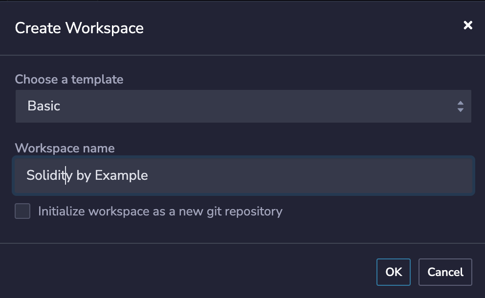
最左边的菜单有四个按钮，分别对应文件，搜索，编译，部署。点新建（Create New File）按钮，就可以创建一个空白的solidity合约。
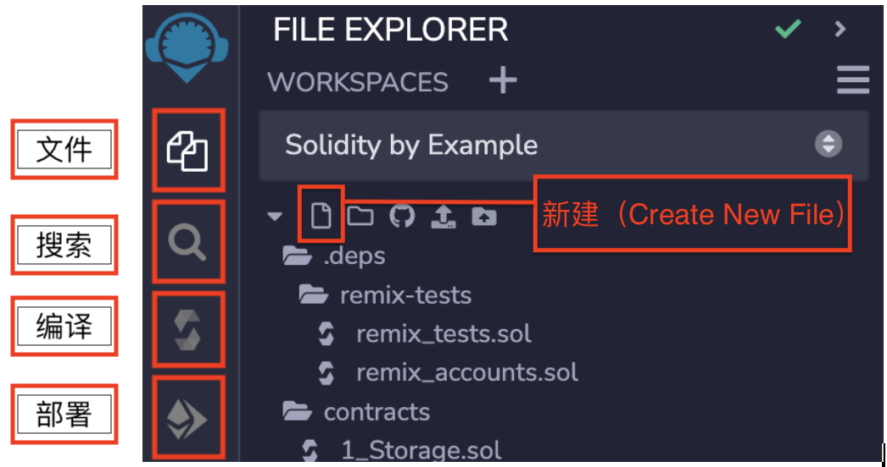

## 1. FILE EXPLORERS
新建智能合约，右键文件夹后选择“New File”创建一个新的合约。
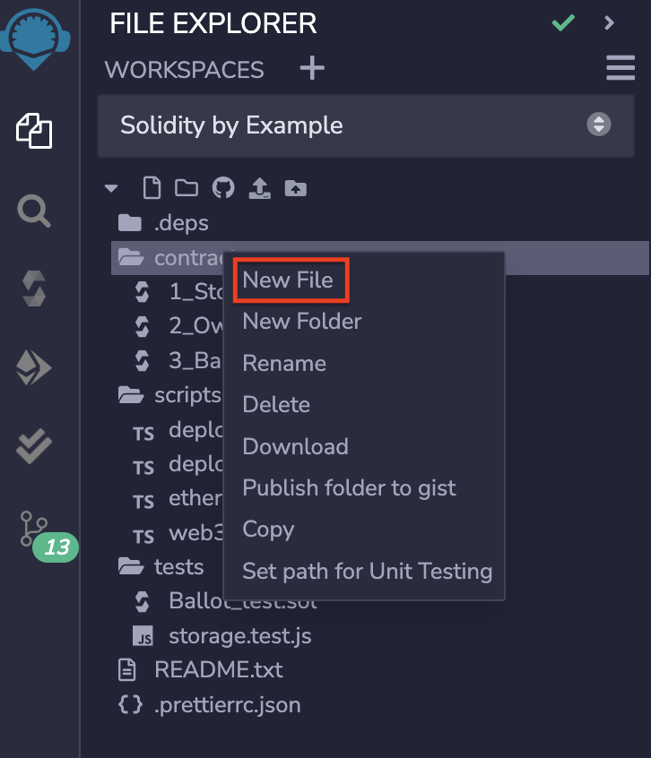
## 2. SOLIDITY COMPILER
当编写完智能合约代码后选中你的合约进行编译。下图中“COMPILER”一栏需要你选择solidity的版本，solidity版本迭代很快可能同样的代码在上个版本成功运行，这个版本就会报错。其默认为最新版本。一般情况下可以勾选自动编译（Auto compile）
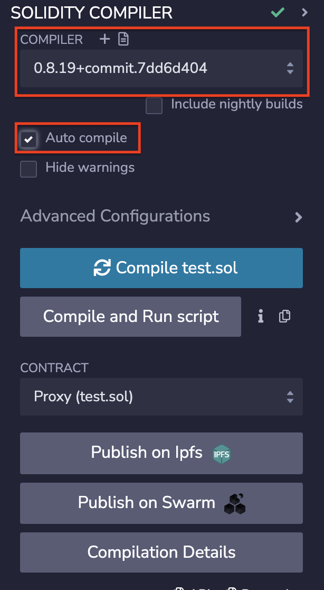
## 3. DEPLOY & RUN TRANSACTIONS
如果编译没有发生错误就可以开始部署合约，在“ENVIRONMENT”一栏需要选择部署环境，在“Remix VM”环境下你会将合约部署在本地中不会连接节点，可以用于测试之中；在“Injected Provider - MetaMask”下你会启用网页插件部署合约比如著名的MetaMask；请确认无误后再部署以免造成损失。
之后在“ACCOUNT”一栏输入你要部署的账户，在“GAS LIMIT”下输入所消耗燃料的上限后即可点击下方按钮部署合约。
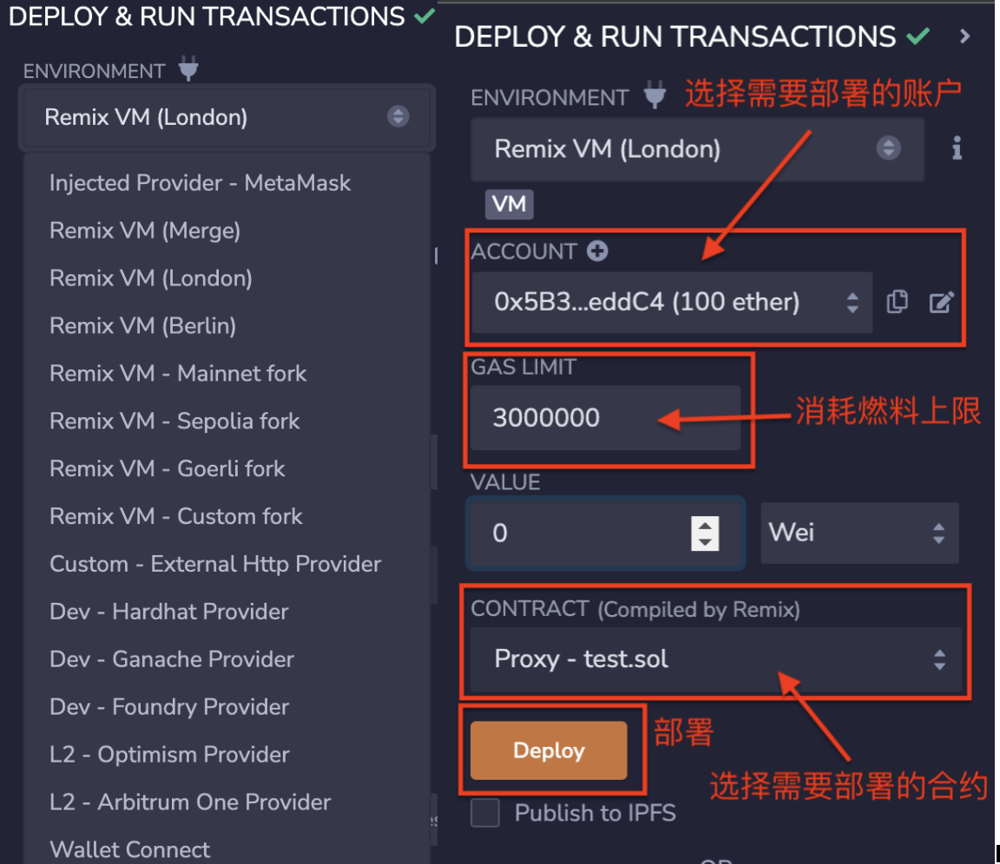
## 4.安装 ETHERSCAN - CONTRACT VERIFICATION 插件
1. 在主界面点击左下角插件管理（PLUGIN MANAGER）按钮。
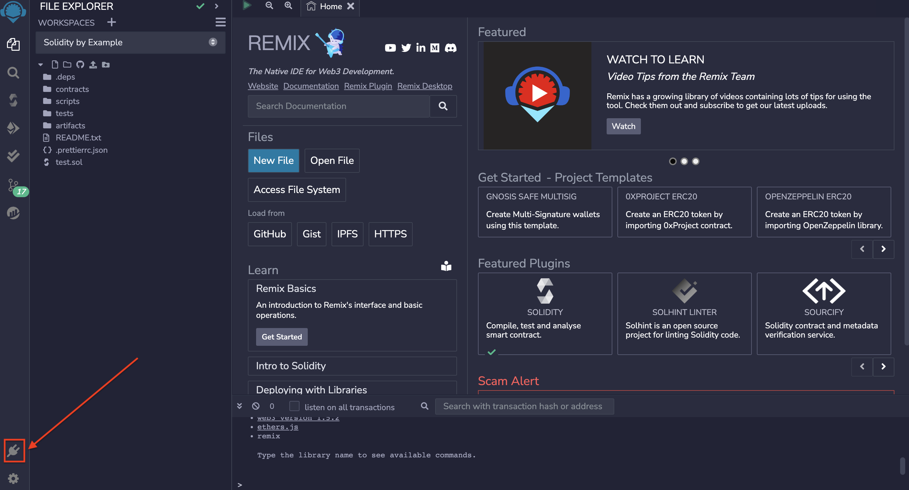
2. 搜索 etherscan - contract verification，并点击激活（Activate）按钮。
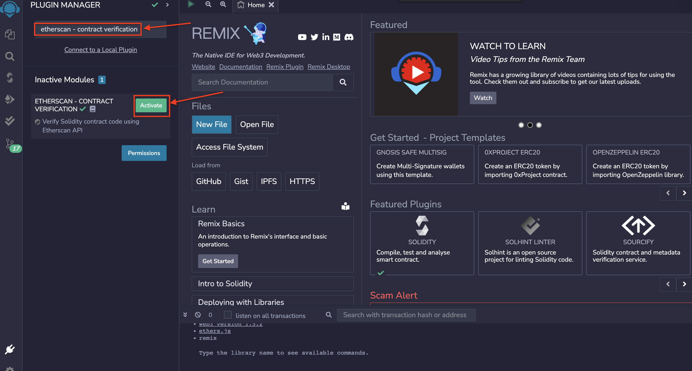
3. 点击左侧工具栏中的 etherscan - contract verification 图标，并输入API Key，点击 按钮 Save API Key。
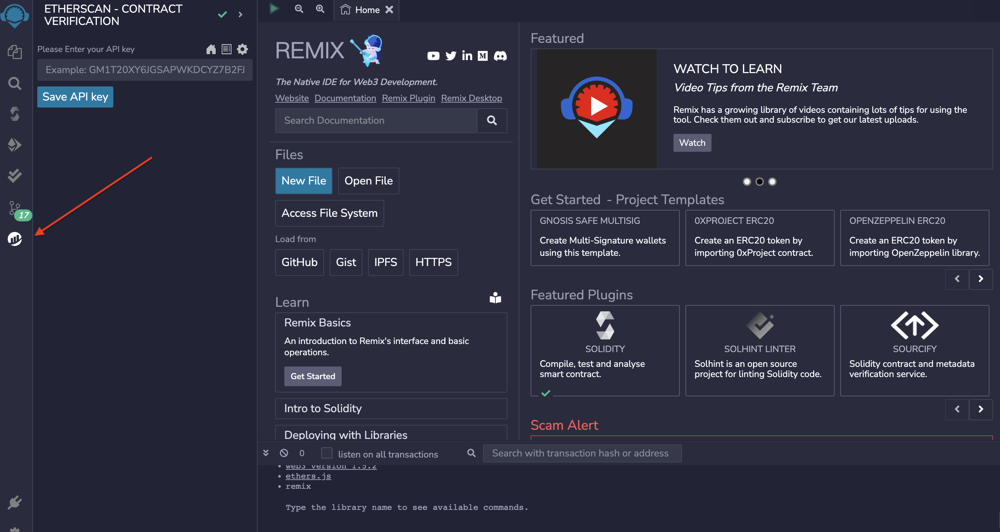
## 5.验证合约
1. 编译合约，选中Sepolia测试网并进行部署。
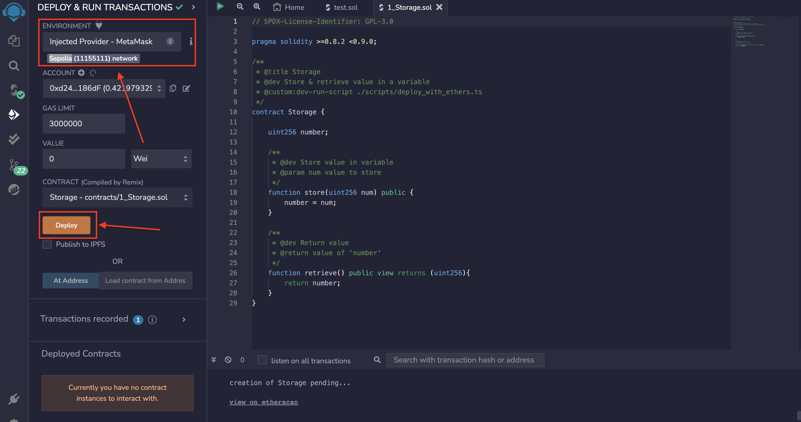
2. 点击view on etherscan获取部署合约地址。
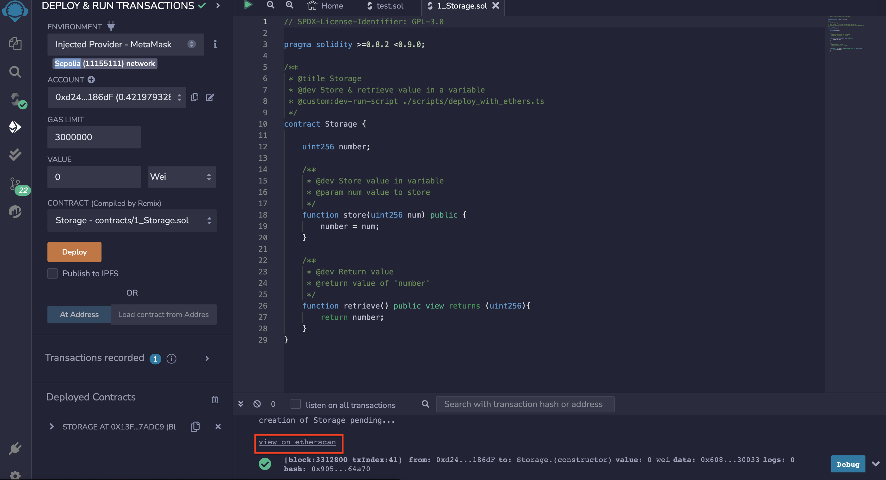
3. 打开验证合约插件，选择待验证的合约名字，输入构造参数的十六进制数据和合约地址，点击按钮Verify Contract。
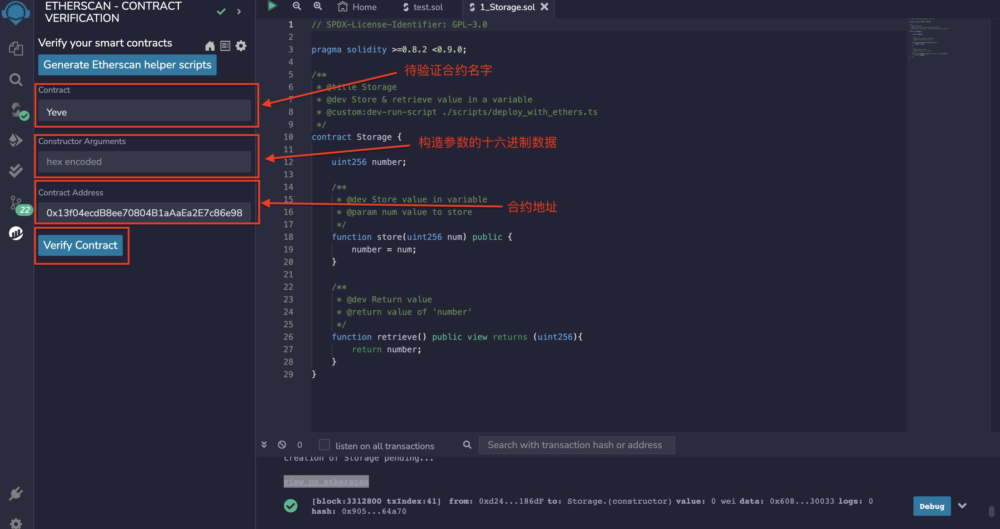
4. 进入合约地址查看验证是否通过。
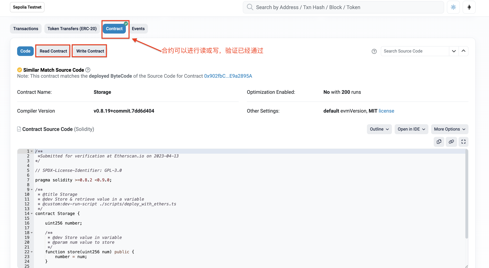
