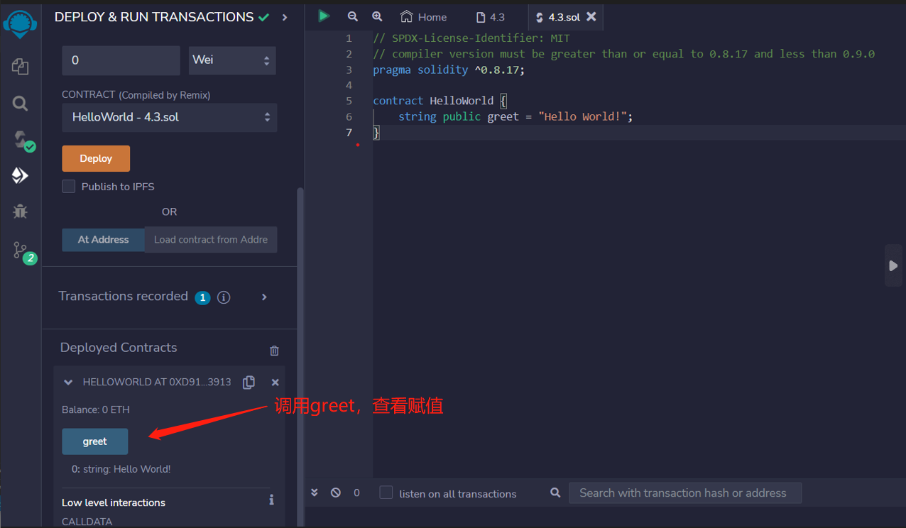

# 01 Hello World

pragma 指定 Solidity 的编译器版本。
来看一个简单的合约
```solidity
// SPDX-License-Identifier: MIT
pragma solidity ^0.8.17;
//定义了一个公共的字符串变量greet，它的值是"Hello World!"。
//在Solidity中，公共变量可以被其他合约和外部应用程序访问。
contract HelloWorld {
    string public greet = "Hello World!";
}
```
拆开分析，学习solidity代码源文件的结构：

第1行是注释，会写一下这个代码所用的软件许可（license），这里用的是MIT license。如果不写许可，编译时会警告（warning），但程序可以运行。solidity的注释由“//”开头，后面跟注释的内容（不会被程序运行）。
```solidity
// SPDX-License-Identifier: MIT
```
第2行声明源文件所用的solidity版本，因为不同版本语法有差别。这行代码意思是源文件将不允许小于 0.8.17 版本或大于等于 0.9.0 版本的编译器编译（第二个条件由^提供）。Solidity 语句以分号（;）结尾。
```solidity
pragma solidity ^0.8.17;
```
第3-4行是合约部分，第3行创建合约（contract），并声明合约的名字 HelloWorld。第4行是合约的内容，我们声明了一个string（字符串）变量greet，并给他赋值 "Hello World!"。
在Solidity中，公共变量可以被其他合约和外部应用程序访问。
```solidity
contract HelloWorld {
    string public greet = "Hello World!";
}
```

## remix验证
1.编译并部署代码
