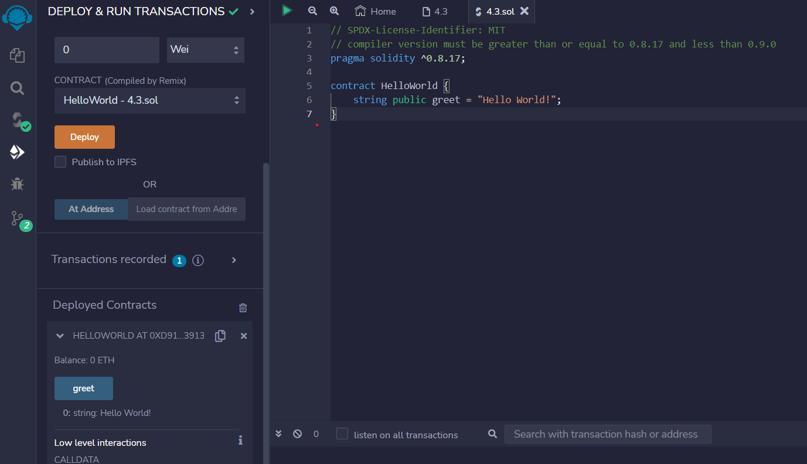

# 01 Hello World

pragma 指定 Solidity 的编译器版本。

```solidity
// SPDX-License-Identifier: MIT
// 编译器版本必须大于或等于0.8.17，但小于0.9.0。

pragma solidity ^0.8.17;
//定义了一个公共的字符串变量greet，它的值是"Hello World!"。
//在Solidity中，公共变量可以被其他合约和外部应用程序访问。
contract HelloWorld {
    string public greet = "Hello World!";
}
```
## remix验证
1.编译并部署代码
