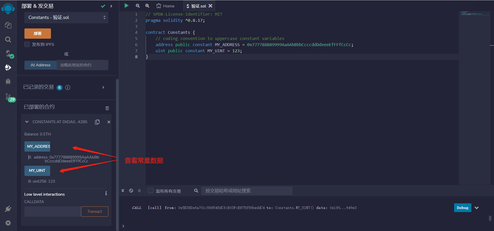

# 5.Constants

常量是不可修改的变量。

它们的值是硬编码的，使用常数可以节省gas成本。
函数定义两个不可修改的常量
1. MY_ADDRESS：一个公共的地址类型常量，其值为 0x777788889999AaAAbBbbCcccddDdeeeEfFFfCcCc。
2. MY_UINT：一个公共的无符号整数类型常量，其值为 123。

constant变量必须在声明的时候初始化，之后再也不能改变。尝试改变的话，编译不通过。

```solidity
    // 编码约定将常量变量大写
    address public constant MY_ADDRESS = 0x777788889999AaAAbBbbCcccddDdeeeEfFFfCcCc;
    uint public constant MY_UINT = 123;
```


## remix验证
1. 编译并部署代码调用MY_ADDRESS显示地址，调用MY_UINT显示整数。
