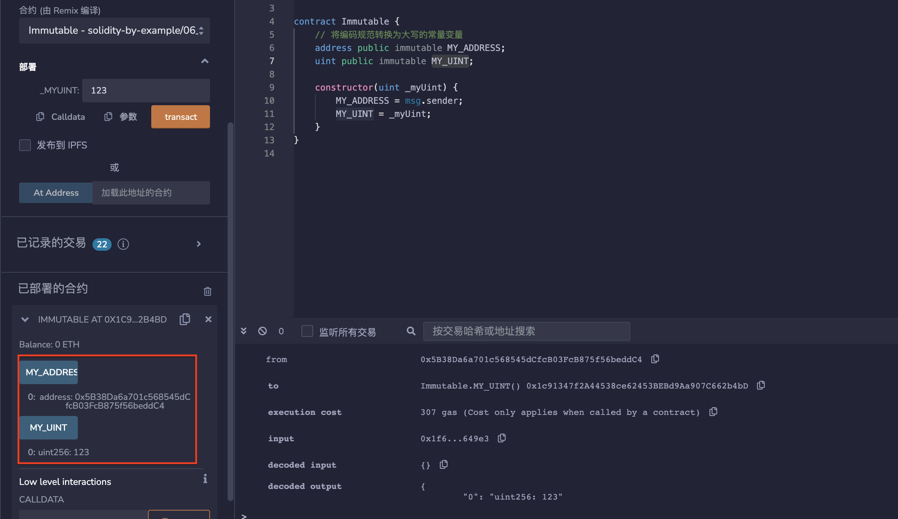

# 6.immutable
immutable变量就像常量一样。immutable变量的值可以在构造函数中设置，但之后不能修改。
immutable变量可以在声明时或构造函数中初始化，因此更加灵活。
```solidity
// 将编码规范转换为大写的常量变量
address public immutable MY_ADDRESS;
uint public immutable MY_UINT;

constructor(uint _myUint) {
    MY_ADDRESS = msg.sender;
    MY_UINT = _myUint;
}
```
## remix验证
部署合约Immutable，在部署时填入MY_UINT的数值123；
调用MY_UINT后显示为123，调用MY_ADDRESS后显示为msg.sender。

