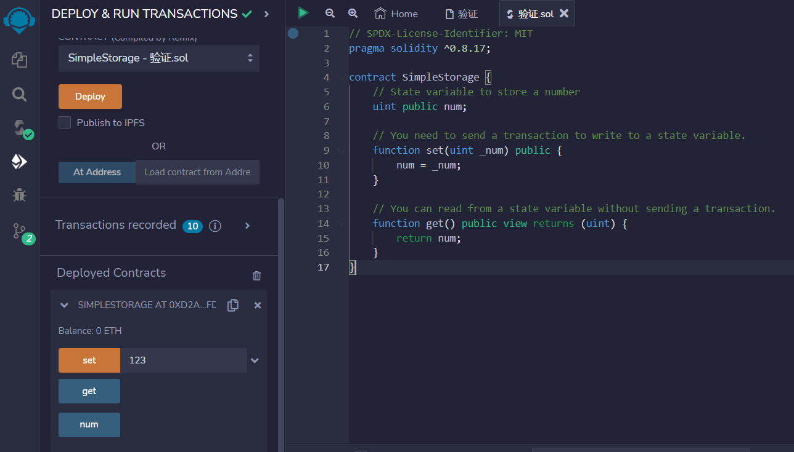
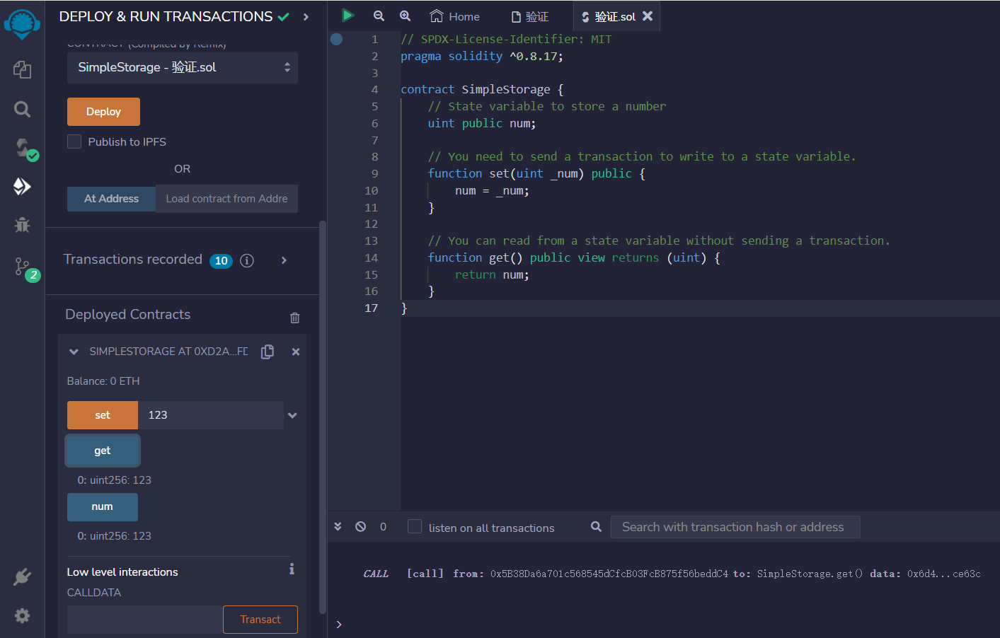

# Reading and Writing to a State Variable

要写入或更新状态变量，您需要发送交易。

另一方面，您可以免费读取状态变量，无需任何交易费用。

```solidity
// SPDX-License-Identifier: MIT
pragma solidity ^0.8.17;

contract SimpleStorage {
    // 存储数字的状态变量
    uint public num;

    // 您需要发送交易才能写入状态变量
    function set(uint _num) public {
        num = _num;
    }

    // 您可以在不发送交易的情况下从状态变量中读取。
    function get() public view returns (uint) {
        return num;
    }
}
```
## remix验证
1.部署合约 调用set写入状态变量

2.调用get可以不消耗gas读取变量
