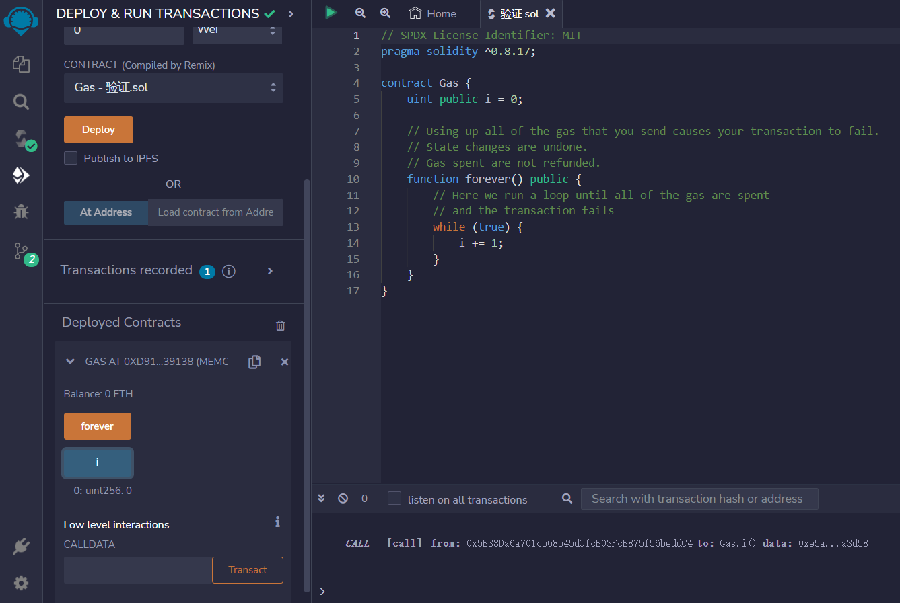
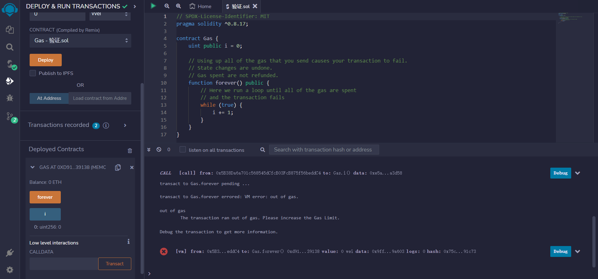

# Gas
一笔交易需要支付多少以太币?
您支付的是gas使用量*gas价格的以太币数量，其中

gas是计算单位
gas spent是交易中使用的总gas量
gas price是指你愿意支付多少gas
gas价格越高的交易，优先级越高

未使用的gas将被退还.

Gas Limit
可以使用的gas量有两个限制

Gas Limit (您愿意为您的交易使用的最大gas量，由您设定)
block gas limit (一个区块允许的最大gas量，由网络设定)

```solidity
// SPDX-License-Identifier: MIT
pragma solidity ^0.8.17;

contract Gas {
    uint public i = 0;

    // 使用完所有gas会使交易失败.
    // 状态更改被撤消.
    // 消耗的gas不会退回.
    function forever() public {
        // 这里是个while循环，直到所有gas消耗完
        // 并导致交易失败
        while (true) {
            i += 1;
        }
    }
}
```

## remix验证
1.部署合约

2.调用forever()进入循环消耗gas 交易失败
