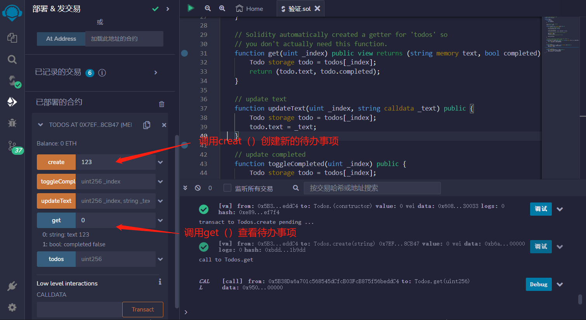

# Structs
你可以通过创建结构体来定义自己的类型。

结构体非常有用，可以将相关的数据进行分组。

结构体可以在合约之外声明，并在另一个合约中进行导入。


## Solidity支持通过构造结构体的形式定义新的类型。创建结构体的方法：
```solidity
    struct Todo {
        string text;
        bool completed;
    }
    // 一个 'Todo' 结构体的数组
    Todo[] public todos;
```

## 有三种初始化结构体的方法
```solidity
    function create(string calldata _text) public {
        // - 像调用函数一样调用它
        todos.push(Todo(_text, false));

        // 键值映射
        todos.push(Todo({text: _text, completed: false}));

        // 初始化一个空的结构体，然后更新它
        Todo memory todo;
        todo.text = _text;
        //todo.completed 初始化为 false

        todos.push(todo);
    }

    // Solidity 自动为 'todos' 创建了一个 getter 函数，你实际上不需要这个函数。
    function get(uint _index) public view returns (string memory text, bool completed) {
        Todo storage todo = todos[_index];
        return (todo.text, todo.completed);
    }
```

### 更新文本
```solidity
    function updateText(uint _index, string calldata _text) public {
        Todo storage todo = todos[_index];
        todo.text = _text;
    }
    // 更新完成状态
    function toggleCompleted(uint _index) public {
        Todo storage todo = todos[_index];
        todo.completed = !todo.completed;
    }
```

## 声明和导入结构体
声明结构体的文件

```solidity
// SPDX-License-Identifier: MIT
pragma solidity ^0.8.17;
// 这个文件保存为 'StructDeclaration.sol'

struct Todo {
    string text;
    bool completed;
}
```

## 导入上面声明的结构体的文件

```solidity
// SPDX-License-Identifier: MIT
pragma solidity ^0.8.17;

import "./StructDeclaration.sol";

contract Todos {
    // 一个 'Todo' 结构体的数组
    Todo[] public todos;
}
```

## remix验证
1.部署 Todos合约，调用create函数，创建结构体,调用get函数，验证是否创建成功

2.