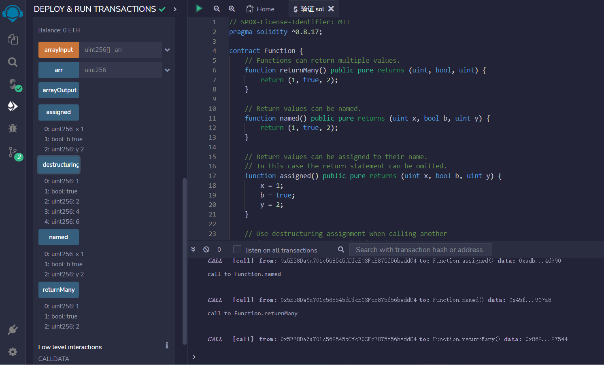
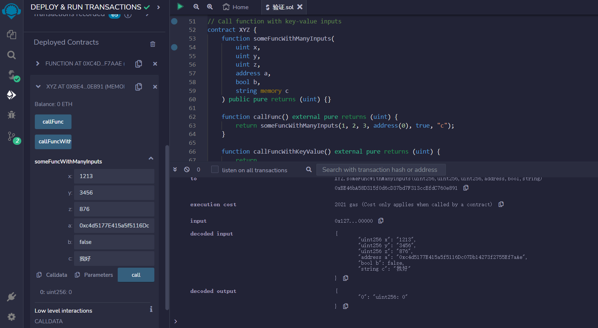

# Function
有几种方法可以从函数返回输出。
公共函数无法调用某些数据类型作为输入或输出

```solidity
// SPDX-License-Identifier: MIT
pragma solidity ^0.8.17;

contract Function {
    // 函数可以返回多个值.
    function returnMany() public pure returns (uint, bool, uint) {
        return (1, true, 2);
    }

    // 返回值可以命名.
    function named() public pure returns (uint x, bool b, uint y) {
        return (1, true, 2);
    }

    // 返回值可以分配给它们的名称.
    // 在这种情况下，可以省略返回语句
    function assigned() public pure returns (uint x, bool b, uint y) {
        x = 1;
        b = true;
        y = 2;
    }

    // 在调用返回多个值的另一个函数时使用解构赋值
    /*
    调用了另一个函数returnMany()，它返回了三个值，我们使用解构赋值将这三个值分别赋值给了i、b和j这三个变量。
    定义了一个元组，它包含了三个值，但我们只需要其中的第一个和第三个值，因此我们使用逗号将第二个值省略掉，然后使用解构赋值将这两个值分别赋值给了变量x和y。
    最后，我们将i、b、j、x和y这五个变量作为返回值返回给调用者
    */
    function destructuringAssignments()
        public
        pure
        returns (uint, bool, uint, uint, uint)
    {
        (uint i, bool b, uint j) = returnMany();

        // 值可以省略.
        (uint x, , uint y) = (4, 5, 6);

        return (i, b, j, x, y);
    }

    // 不能使用映射作为输入或输出

    // 可以使用数组作为输入
    function arrayInput(uint[] memory _arr) public {}

    // 可以使用数组作为输出
    uint[] public arr;

    function arrayOutput() public view returns (uint[] memory) {
        return arr;
    }
}

// 使用键值输入调用函数
contract XYZ {
    function someFuncWithManyInputs(
        uint x,
        uint y,
        uint z,
        address a,
        bool b,
        string memory c
    ) public pure returns (uint) {}

    //按照函数定义中参数的顺序依次传递参数值
    function callFunc() external pure returns (uint) {
        return someFuncWithManyInputs(1, 2, 3, address(0), true, "c");
    }

    //按照函数定义中参数的名称及其对应的值进行传递
    function callFuncWithKeyValue() external pure returns (uint) {
        return
            someFuncWithManyInputs({a: address(0), b: true, c: "c", x: 1, y: 2, z: 3});
    }
}
```
## remix验证
1.部署 Function合约,调用returnMany函数查看函数返回值,调用named函数给返回值命名，

2.部署XYZ合约，调用someFuncWithManyInputs函数，输入六个参数：三个无符号整数（x、y和z）、一个地址（a）、一个布尔值（b）和一个字符串（c）。该函数是一个纯函数，不会修改合约状态，并且返回一个无符号整数。
