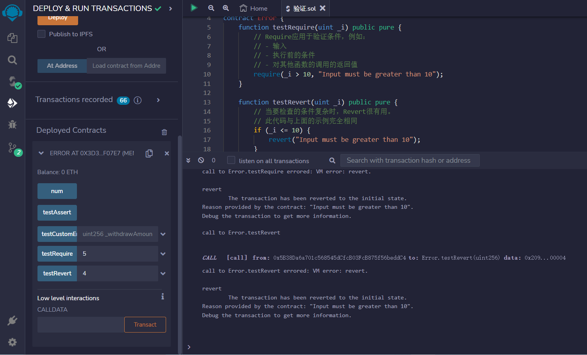
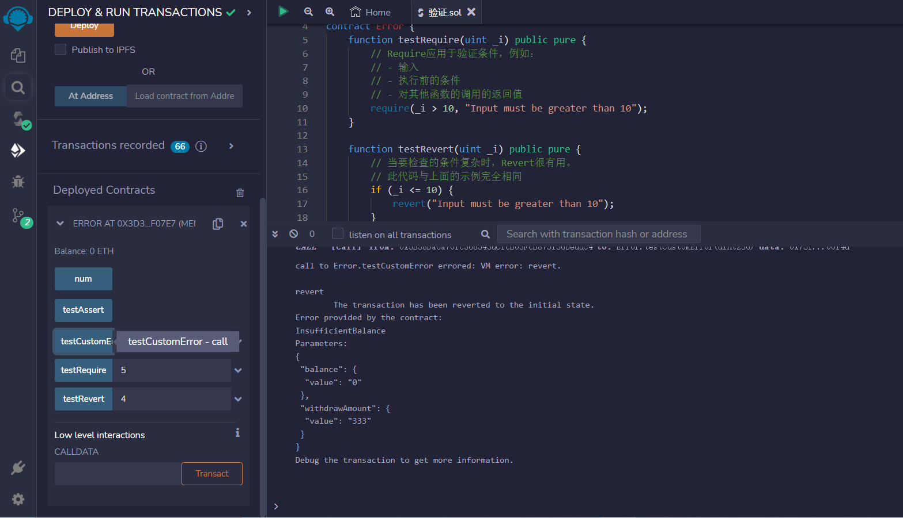
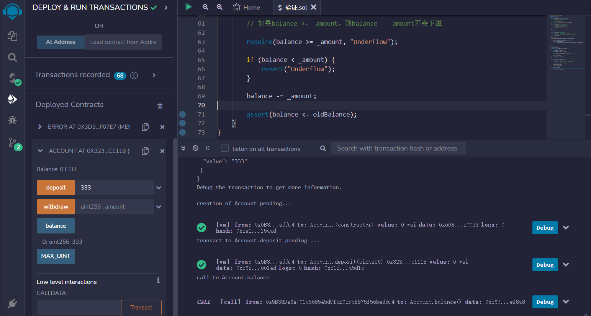
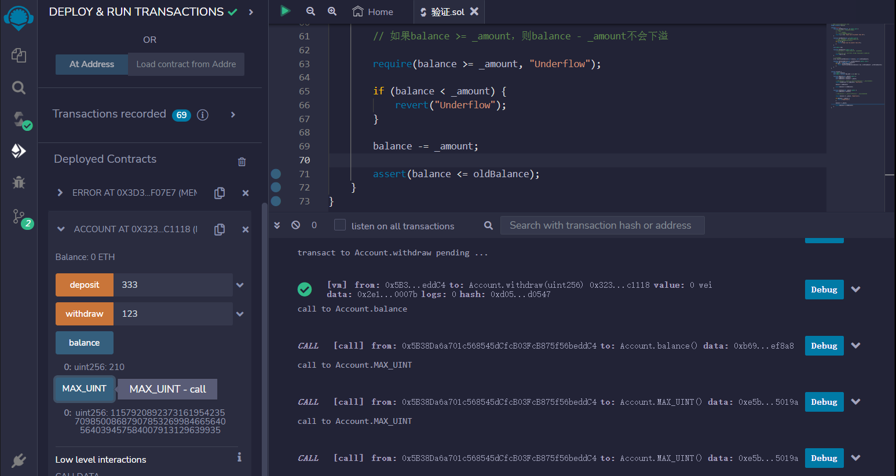

# Error
错误会撤销合约编译期间对状态所做的所有更改。

您可以通过调用require、revert或assert来引发错误。

require用于在执行之前验证输入和条件
revert与require类似。有关详细信息，请参见下面的代码。
assert用于检查永远不应为false的代码。失败的断言可能意味着存在错误。
使用自定义错误以节省gas。

```solidity
// SPDX-License-Identifier: MIT
pragma solidity ^0.8.17;

contract Error {
    function testRequire(uint _i) public pure {
        // Require应用于验证条件，例如：
        // - 输入
        // - 执行前的条件
        // - 对其他函数的调用的返回值
        require(_i > 10, "Input must be greater than 10");
    }

    function testRevert(uint _i) public pure {
        // 当要检查的条件复杂时，Revert很有用。
        // 此代码与上面的示例完全相同
        if (_i <= 10) {
            revert("Input must be greater than 10");
        }
    }

    uint public num;

    function testAssert() public view {
        // Assert仅应用于测试内部错误，并检查不变量。

        // 在这里，我们断言num始终等于0，因为更新num的值是不可能的
        assert(num == 0);
    }

    // 自定义错误
    error InsufficientBalance(uint balance, uint withdrawAmount);

    function testCustomError(uint _withdrawAmount) public view {
        uint bal = address(this).balance;
        if (bal < _withdrawAmount) {
            revert InsufficientBalance({balance: bal, withdrawAmount: _withdrawAmount});
        }
    }
}
```
这是另一个示例

```solidity
// SPDX-License-Identifier: MIT
pragma solidity ^0.8.17;

contract Account {
    uint public balance;
    uint public constant MAX_UINT = 2 ** 256 - 1;

    function deposit(uint _amount) public {
        uint oldBalance = balance;
        uint newBalance = balance + _amount;

        // 如果balance + _amount >= balance，则balance + _amount不会溢出
        require(newBalance >= oldBalance, "Overflow");

        balance = newBalance;

        assert(balance >= oldBalance);
    }

    function withdraw(uint _amount) public {
        uint oldBalance = balance;

        // 如果balance >= _amount，则balance - _amount不会下溢

        require(balance >= _amount, "Underflow");

        if (balance < _amount) {
            revert("Underflow");
        }

        balance -= _amount;

        assert(balance <= oldBalance);
    }
}
```

## remix验证
1.部署 Error合约,testRequire()须大于10否则抛出错误信息；testRevert()如果小于或等于10则抛出错误信息

2.调用testCustomError函数，输入一个 uint 类型的参数 _withdrawAmount，，它使用自定义错误 InsufficientBalance，如果合约余额小于 _withdrawAmount，则会使用 revert 抛出一个带有自定义错误消息的异常，消息中包含合约余额和要提取的金额。

3.部署另一个例子Account合约，调用deposit函数表示要存储的金额，首先将原有的balance保存在oldBalance中，然后计算新的余额newBalance。调用balance查看。

4.调用withdraw函数取款，在取款之前，使用require函数检查balance是否大于等于_amount，如果不是，则抛出异常Underflow。如果balance小于_amount，则使用revert函数抛出异常Underflow。如果balance不小于_amount，则更新balance的值，并使用assert函数再次检查balance是否小于等于oldBalance。

