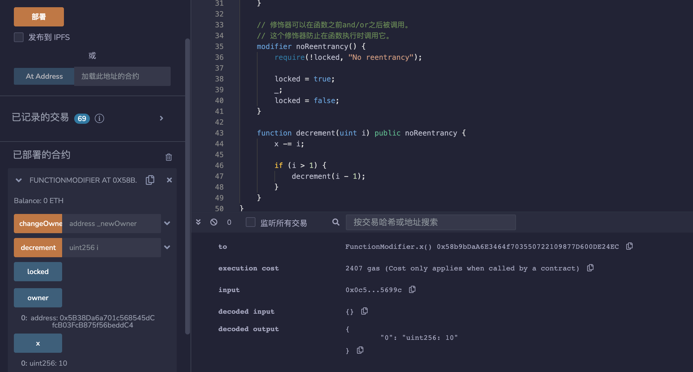
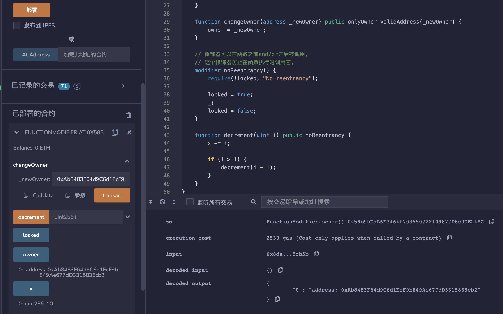
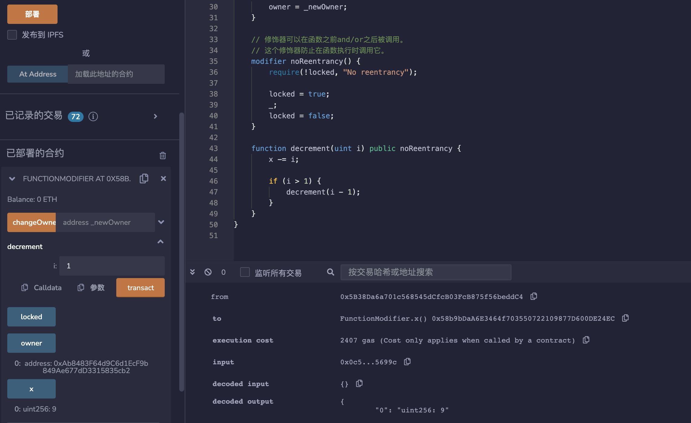

# 20.Function Modifier

修饰器是可以在函数调用之前 and/or 之后运行的代码。
修饰器可以用于：
1、限制访问权限
2、验证输入
3、防止重入攻击

修饰器可用于检查调用者是否是合约的所有者。使用修饰器modifier 可以轻松改变函数的行为。 例如，它们可以在执行函数之前自动检查某个条件。 修饰器modifier 是合约的可继承属性， 并可能被派生合约覆盖。

```solidity
modifier onlyOwner() {
    require(msg.sender == owner, "Not owner");
    // 下划线是一种特殊字符，仅在函数修饰器中使用，
    // 它告诉Solidity继续执行代码的其余部分。
    _;
}
```

修饰器可以接受输入参数。该修饰器检查传入的地址是否为零地址。

```solidity
modifier validAddress(address _addr) {
    require(_addr != address(0), "Not valid address");
    _;
}

function changeOwner(address _newOwner) public onlyOwner validAddress(_newOwner) {
    owner = _newOwner;
}
```
修饰器可以在函数之前and/or之后被调用。这个修饰器防止在函数执行时调用它。
```solidity
modifier noReentrancy() {
    require(!locked, "No reentrancy");

    locked = true;
    _;
    locked = false;
}

function decrement(uint i) public noReentrancy {
    x -= i;

    if (i > 1) {
        decrement(i - 1);
    }
}
```
# remix测试
1. 部署合约FunctionModifier，可以看到owner为msg.sender，x = 10。

2. 调用changeOwner（）函数，非msg.sender会调用失败，调用成功修改owner。

3. modifier可以防止重入攻击，调用decrement（）函数输入1，x显示为9。

