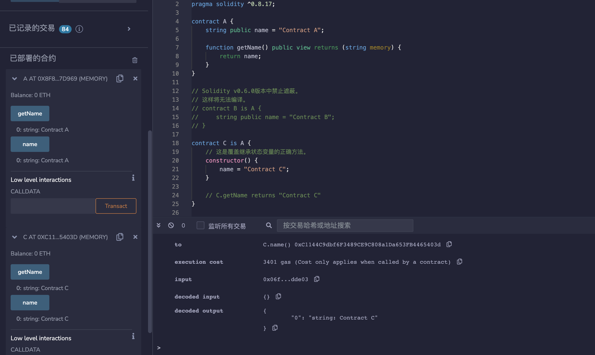

# 24.Shadowing Inherited State Variables

与函数不同，状态变量不能通过在子合约中重新声明来覆盖它。

让我们学习如何正确地覆盖继承的状态变量。

```solidity
contract A {
    string public name = "Contract A";

    function getName() public view returns (string memory) {
        return name;
    }
}
```
在Solidity v0.6.0版本中禁止遮蔽，这样将无法编译。

```solidity
contract B is A {
    string public name = "Contract B";
}
```
这是覆盖继承状态变量的正确方法。
```solidity
contract C is A {
    // 这是覆盖继承状态变量的正确方法。
    constructor() {
        name = "Contract C";
    }

    // C.getName returns "Contract C"
}
```
# remix验证
部署合约A，C，调用C，显示已被覆盖。

