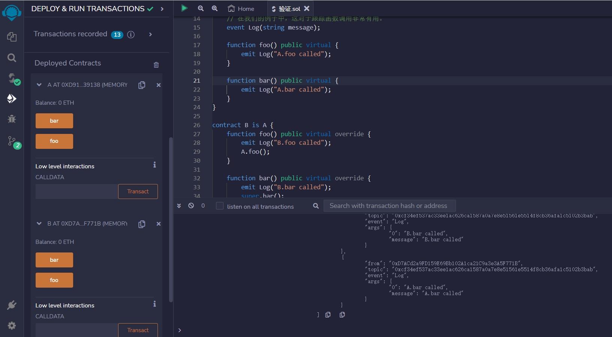

# Calling Parent Contracts
可以直接调用父合约，也可以使用关键字super。

使用关键字super，将直接调用所有父合约。

```solidity
// SPDX-License-Identifier: MIT
pragma solidity ^0.8.17;

/* 继承树
   A
 /  \
B   C
 \ /
  D
*/

contract A {
    // 这是一个事件。你可以从你的函数中发出事件，并将它们记录到交易日志中。
    // 在我们的例子中，这对于查看跟踪函数调用非常有用。
    event Log(string message);

    function foo() public virtual {
        emit Log("A.foo called");
    }

    function bar() public virtual {
        emit Log("A.bar called");
    }
}

contract B is A {
    function foo() public virtual override {
        emit Log("B.foo called");
        A.foo();
    }

    function bar() public virtual override {
        emit Log("B.bar called");
        super.bar();
    }
}

contract C is A {
    function foo() public virtual override {
        emit Log("C.foo called");
        A.foo();
    }

    function bar() public virtual override {
        emit Log("C.bar called");
        super.bar();
    }
}

contract D is B, C {
    // 尝试：
    // - 调用D.foo并检查事务日志。
    //   尽管D继承了A、B和C，但它只调用了C，然后是调用A。
    // - 调用D.bar并检查事务日志
    //   D先调用了C，然后是调用B，最后是调用A。
    //   尽管super被B和C调用了两次，但它只调用了A一次。

    function foo() public override(B, C) {
        super.foo();
    }

    function bar() public override(B, C) {
        super.bar();
    }
}
```

## remix验证
1.部署A,B,C合约，在合约B和C中，分别重写了函数foo和bar，并在这两个函数中也都发出了事件Log,在交易日记中查看。

2.部署D合约，查看日记，可以看出继承树顺序，从而验证多重继承。
