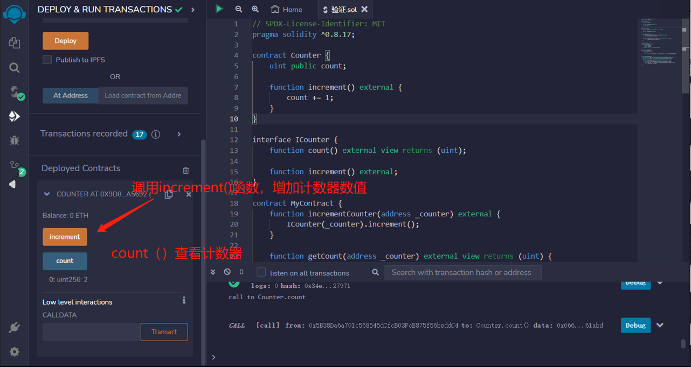
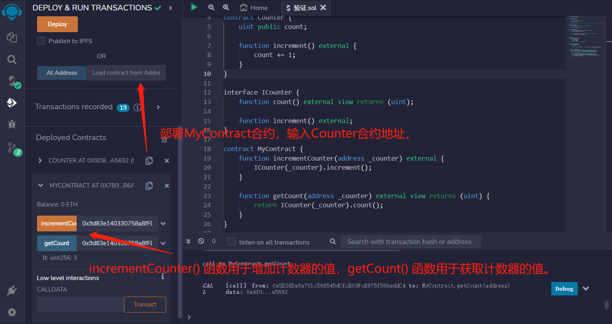

# Interface
您可以通过声明接口与其他合约交互。

## 接口

1. 不能包含状态变量
2. 不能包含构造函数
3. 不能继承除接口外的其他合约
4. 所有函数都必须是external且不能有函数体
5. 继承接口的合约必须实现接口定义的所有功能

虽然接口不实现任何功能，但它非常重要。接口是智能合约的骨架，定义了合约的功能以及如何触发它们：
如果智能合约实现了某种接口（比如ERC20或ERC721），其他Dapps和智能合约就知道如何与它交互。

简单合约
```solidity
contract Counter {
    uint public count;

    function increment() external {
        count += 1;
    }
}
```

### 接口
```solidity
interface ICounter {
    function count() external view returns (uint);

    function increment() external;
}
contract MyContract {
    //接受一个地址参数_counter，调用ICounter接口中的increment函数来增加_counter地址对应的计数器
    function incrementCounter(address _counter) external {
        ICounter(_counter).increment();
    }
    
    //接受一个地址参数_counter，返回ICounter接口中的count函数返回的计数器值
    function getCount(address _counter) external view returns (uint) {
        return ICounter(_counter).count();
    }
}
```

### Uniswap 列子
```solidity
interface UniswapV2Factory {
    function getPair(
        address tokenA,
        address tokenB
    ) external view returns (address pair);
}

interface UniswapV2Pair {
    function getReserves()
        external
        view
        returns (uint112 reserve0, uint112 reserve1, uint32 blockTimestampLast);
}

contract UniswapExample {
    address private factory = 0x5C69bEe701ef814a2B6a3EDD4B1652CB9cc5aA6f;
    address private dai = 0x6B175474E89094C44Da98b954EedeAC495271d0F;
    address private weth = 0xC02aaA39b223FE8D0A0e5C4F27eAD9083C756Cc2;

    function getTokenReserves() external view returns (uint, uint) {
        address pair = UniswapV2Factory(factory).getPair(dai, weth);
        (uint reserve0, uint reserve1, ) = UniswapV2Pair(pair).getReserves();
        return (reserve0, reserve1);
    }
}
```


## remix验证
1.部署Counter 合约，调用increment()函数，增加计数器数值

2.部署MyContract合约，调用incrementCounter函数，输入Counter合约地址，调用ICounter 接口中的函数来操作计数器。incrementCounter() 函数用于增加计数器的值，getCount() 函数用于获取计数器的值。
