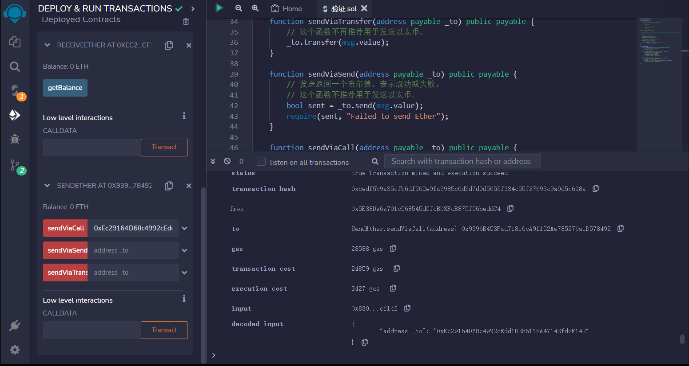

# Sending Ether (transfer, send, call)
如何发送以太币？
您可以通过以下方式将以太币发送到其他合同：

转账（2300 gas，抛出错误）
发送（2300 gas，返回布尔值）
调用（转发所有gas或设置gas，返回布尔值）
如何接收以太币？
接收以太币的合同必须至少有以下一个函数：

receive() external payable
fallback() external payable
如果msg.data为空，则调用receive()，否则调用fallback()。

应该使用哪种方法？
在2019年12月之后，结合重入保护的调用是推荐使用的方法。

通过以下方式防止重入：

在调用其他合同之前进行所有状态更改
使用重入保护修饰器

```solidity
// SPDX-License-Identifier: MIT
pragma solidity ^0.8.17;

contract ReceiveEther {
    /*
    哪个函数被调用，fallback()还是receive()？

           发送以太币

               |
         msg.data 是否为空？
              / \
            yes  no
            /     \
receive()是否存在？  fallback()
         /   \
        yes   no
        /      \
    receive()   fallback()
    */

    // 接收以太币的函数。msg.data必须为空
    receive() external payable {}

    // 当msg.data不为空时调用这个回退函数
    fallback() external payable {}

    function getBalance() public view returns (uint) {
        return address(this).balance;
    }
}

contract SendEther {
    function sendViaTransfer(address payable _to) public payable {
        // 这个函数不再推荐用于发送以太币。
        _to.transfer(msg.value);
    }

    function sendViaSend(address payable _to) public payable {
        // 发送返回一个布尔值，表示成功或失败。
        // 这个函数不推荐用于发送以太币。
        bool sent = _to.send(msg.value);
        require(sent, "Failed to send Ether");
    }

    function sendViaCall(address payable _to) public payable {
        // 调用返回一个布尔值，表示成功或失败。
        // 这是目前推荐使用的方法。
        (bool sent, bytes memory data) = _to.call{value: msg.value}("");
        require(sent, "Failed to send Ether");
    }
}
```


## remix验证
1.部署ReceiveEther、SendEther合约 推荐使用sendViaCall发送以太币
