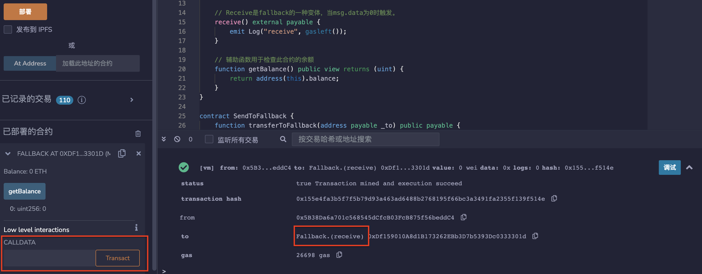

# 30.Fallback
fallback是一种特殊的函数，当以下情况发生时执行：
1.调用不存在的函数时；
2.将以太币直接发送到合约但receive( )不存在或msg.data不为空时。
当通过transfer或send调用时，fallback的gas限制为2300。
回退函数必须声明为external函数。
```solidity
fallback() external payable {
    // 发送/转移（将2300个gas转发到此回退函数）
    // call (转发所有gas)
    emit Log("fallback", gasleft());
}
```
Receive是fallback的一种变体，当msg.data为0时触发。
```solidity
    receive() external payable {
        emit Log("receive", gasleft());
    }
```
辅助函数用于检查此合约的余额。
```solidity
    function getBalance() public view returns (uint) {
        return address(this).balance;
    }
```
# remix验证
使用calldata低级别调用不存在的函数，显示调用成功，执行fallback（）函数。

msg.data为0时，触发receive（）函数。

