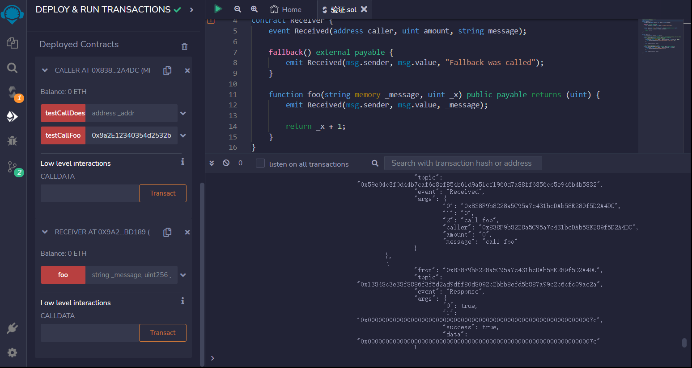
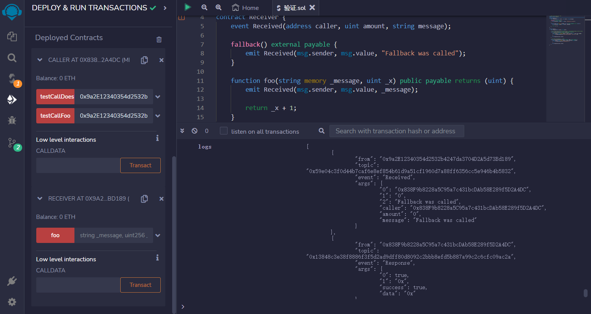

# Call
call是与其他合约进行交互的低级函数。

当您仅通过调用回退函数发送以太时，这是推荐的方法。

然而，这不是调用现有函数的推荐方式。

低级别的调用不推荐的原因：
回滚不会向上溢出
类型检查被绕过
函数存在性检查被省略

```solidity
// SPDX-License-Identifier: MIT
pragma solidity ^0.8.17;

contract Receiver {
    event Received(address caller, uint amount, string message);

    fallback() external payable {
        emit Received(msg.sender, msg.value, "Fallback was called");
    }

    function foo(string memory _message, uint _x) public payable returns (uint) {
        emit Received(msg.sender, msg.value, _message);

        return _x + 1;
    }
}

contract Caller {
    event Response(bool success, bytes data);

    // 假设合约调用者没有合约接收者的源代码，但我们知道合约接收者的地址和要调用的函数。
    function testCallFoo(address payable _addr) public payable {
        // 你可以发送ether并指定自定义的 gas 数量。
        (bool success, bytes memory data) = _addr.call{value: msg.value, gas: 5000}(
            abi.encodeWithSignature("foo(string,uint256)", "call foo", 123)
        );

        emit Response(success, data);
    }

    // 调用不存在的函数会触发回退函数。
    function testCallDoesNotExist(address payable _addr) public payable {
        (bool success, bytes memory data) = _addr.call{value: msg.value}(
            abi.encodeWithSignature("doesNotExist()")
        );

        emit Response(success, data);
    }
}
```


## remix验证
1.部署Caller、Receiver合约，调用testCallFoo函数，输入Caller合约地址，验证。如果调用成功，它将返回 true 和一个包含函数返回值的字节数组。如果调用失败，它将返回 false 和一个包含错误信息的字节数组。无论调用是否成功，Caller 合约都会触发一个 Response 事件。

2.当 testCallDoesNotExist 函数被调用时，它会使用指定的以太币调用 Receiver 合约中不存在的函数。由于该函数不存在，它将触发 fallback 函数，并返回 false 和一个包含 fallback 函数事件信息的字节数组。无论调用是否成功，Caller 合约都会触发一个 Response 事件。
