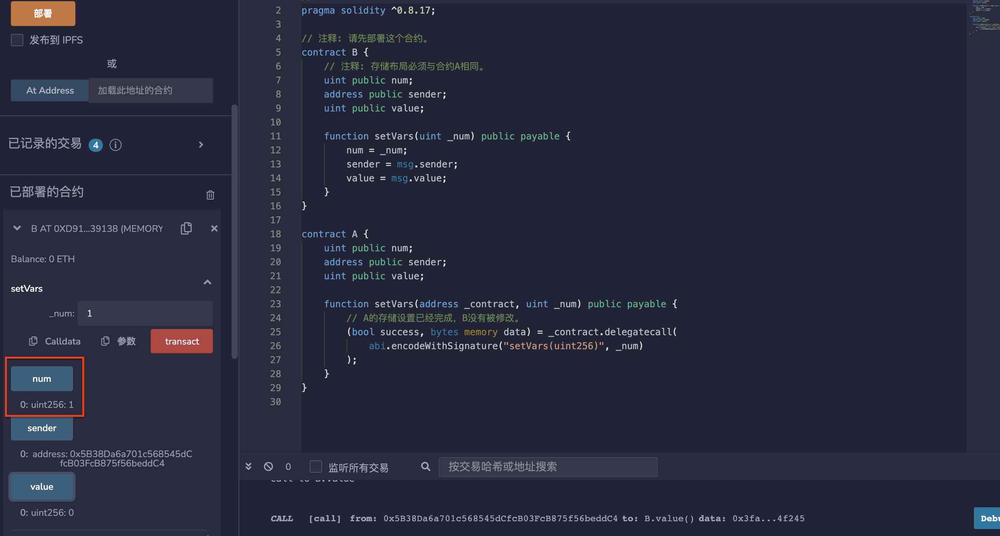
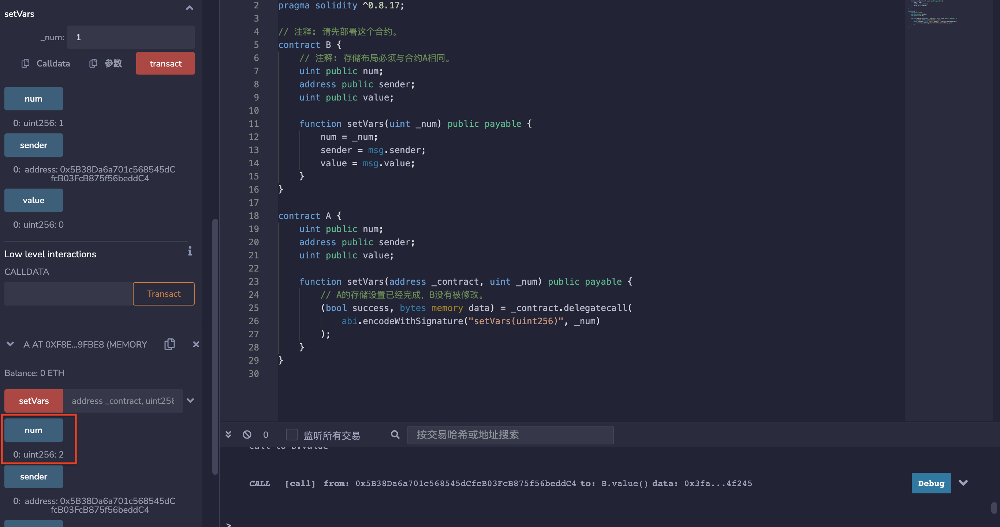

# 32.Delegatecall
## delegatecall
delegatecall是类似于call的低级函数。
当合约A执行delegatecall到合约B时，B的代码将在合约A的storage、msg.sender和msg.value下执行。
* delegatecall语法和call类似：
```solidity
目标合约地址.delegatecall(二进制编码);
```

* 其中二进制编码利用结构化编码函数abi.encodeWithSignature获得：
```solidity
abi.encodeWithSignature("函数签名", 逗号分隔的具体参数)
```

* 部署合约B，存储布局必须与合约A相同。
```solidity
contract B {
    uint public num;
    address public sender;
    uint public value;

    function setVars(uint _num) public payable {
        num = _num;
        sender = msg.sender;
        value = msg.value;
    }
}
```

* 部署合约A
```solidity
contract A {
    uint public num;
    address public sender;
    uint public value;

    function setVars(address _contract, uint _num) public payable {
        // A的存储设置已经完成，B没有被修改。
        (bool success, bytes memory data) = _contract.delegatecall(
            abi.encodeWithSignature("setVars(uint256)", _num)
        );
    }
}
```
注意：delegatecall有安全隐患，使用时要保证当前合约和目标合约的状态变量存储结构相同，并且目标合约安全，不然会造成资产损失。

## delegatecall应用场景

1. 代理合约（Proxy Contract）：将智能合约的存储合约和逻辑合约分开：代理合约（Proxy Contract）存储所有相关的变量，并且保存逻辑合约的地址；所有函数存在逻辑合约（Logic Contract）里，通过delegatecall执行。当升级时，只需要将代理合约指向新的逻辑合约即可。
2. EIP-2535 Diamonds（钻石）：钻石是一个支持构建可在生产中扩展的模块化智能合约系统的标准。钻石是具有多个实施合同的代理合同。 更多信息请查看：钻石标准简介。
   
## remix验证
部署合约B，调用setVars（）函数，输入数值1，显示为1。

部署合约A，调用setVars（）函数，输入合约B的地址和数值2，A显示数值为2，合约B未改变。

