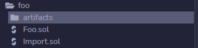
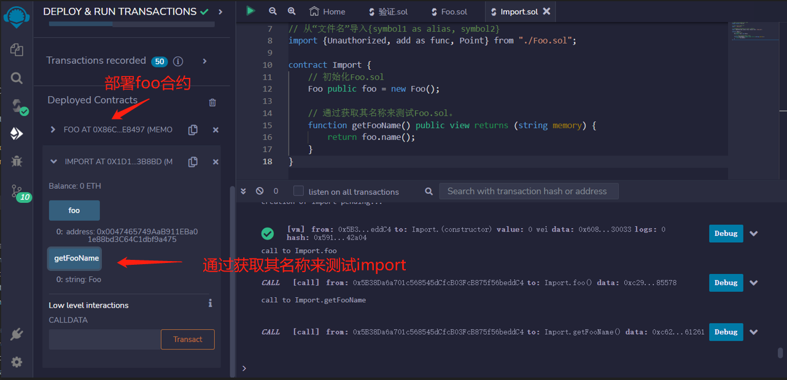

# Import
在Solidity中，您可以导入本地和外部文件。

import关键字导入外部源代码的方法。通过import关键字，可以引用我们写的其他文件中的合约或者函数，也可以直接导入别人写好的代码，非常方便。
## Local
这是我们的文件夹结构。

```solidity
├── Import.sol
└── Foo.sol
Foo.sol
```
### foo.sol
```solidity
// SPDX-License-Identifier: MIT
pragma solidity ^0.8.17;

struct Point {
    uint x;
    uint y;
}

error Unauthorized(address caller);

function add(uint x, uint y) pure returns (uint) {
    return x + y;
}

contract Foo {
    string public name = "Foo";
}
```


### Import.sol

```solidity
// SPDX-License-Identifier: MIT
pragma solidity ^0.8.17;

// 从当前目录导入Foo.sol
import "./Foo.sol";

// 从“文件名”导入{symbol1 as alias, symbol2}
import {Unauthorized, add as func, Point} from "./Foo.sol";

contract Import {
    // 初始化Foo.sol
    Foo public foo = new Foo();

    // 通过获取其名称来测试Foo.sol。
    function getFooName() public view returns (string memory) {
        return foo.name();
    }
}
```
## External
您还可以通过简单地复制URL来从GitHub导入


```solidity
// https://github.com/owner/repo/blob/branch/path/to/Contract.sol
import "https://github.com/owner/repo/blob/branch/path/to/Contract.sol";

// 例如，从openzeppelin-contract repo的release-v4.5分支导入ECDSA.sol
// https://github.com/OpenZeppelin/openzeppelin-contracts/blob/release-v4.5/contracts/utils/cryptography/ECDSA.sol
import "https://github.com/OpenZeppelin/openzeppelin-contracts/blob/release-v4.5/contracts/utils/cryptography/ECDSA.sol";
```


## remix验证
1.创建本地文件夹

2.部署Import合约，初始化Foo.sol。通过获取其名称来测试Foo.sol。
