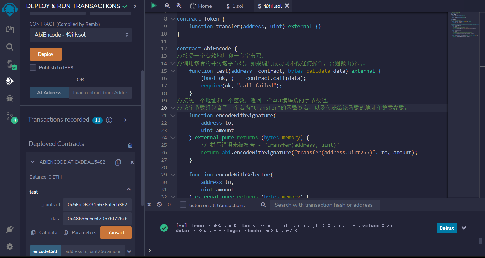
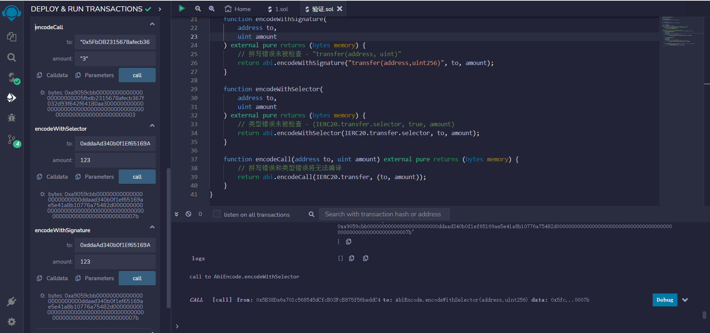

# ABI Encode

```solidity
// SPDX-License-Identifier: MIT
pragma solidity ^0.8.17;

interface IERC20 {
    function transfer(address, uint) external;
}

contract Token {
    function transfer(address, uint) external {}
}

contract AbiEncode {
//接受一个合约地址和一段字节码，
//调用该合约并传递字节码，如果调用成功则不做任何操作，否则抛出异常。
    function test(address _contract, bytes calldata data) external {
        (bool ok, ) = _contract.call(data);
        require(ok, "call failed");
    }
//接受一个地址和一个整数，返回一个ABI编码后的字节数组，
//该字节数组包含了一个名为"transfer"的函数签名，以及传递给该函数的地址和整数参数。
    function encodeWithSignature(
        address to,
        uint amount
    ) external pure returns (bytes memory) {
        // 拼写错误未被检查 - "transfer(address, uint)"
        return abi.encodeWithSignature("transfer(address,uint256)", to, amount);
    }

    function encodeWithSelector(
        address to,
        uint amount
    ) external pure returns (bytes memory) {
        // 类型错误未被检查 - (IERC20.transfer.selector, true, amount)
        return abi.encodeWithSelector(IERC20.transfer.selector, to, amount);
    }

    function encodeCall(address to, uint amount) external pure returns (bytes memory) {
        // 拼写错误和类型错误将无法编译
        return abi.encodeCall(IERC20.transfer, (to, amount));
    }
}
```


## remix验证
1.部署AbiEncode合约，调用test函数输入一个合约地址和一段字节码，验证

2.验证encodeWithSignature、encodeWithSelector、encodeCall，三个错误函数编码
