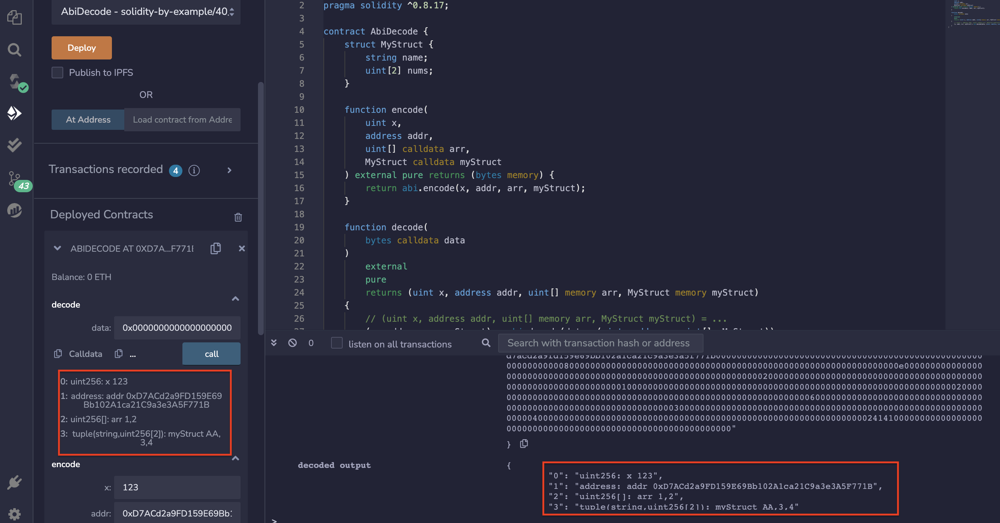

# 40.ABI Decode
abi.encode将数据编码为字节。
```solidity
function encode(
        uint x,
        address addr,
        uint[] calldata arr,
        MyStruct calldata myStruct
    ) external pure returns (bytes memory) {
        return abi.encode(x, addr, arr, myStruct);
    }
```
abi.decode将字节解码回数据。
```solidity
function decode(
    bytes calldata data
)
    external
    pure
    returns (uint x, address addr, uint[] memory arr, MyStruct memory myStruct)
{
    // (uint x, address addr, uint[] memory arr, MyStruct myStruct) = ...
    (x, addr, arr, myStruct) = abi.decode(data, (uint, address, uint[], MyStruct));
}
```
## remix验证
部署合约，调用encode（）函数传入参数进行编码。

调用decode（）函数对上文编码后参数进行解码。

