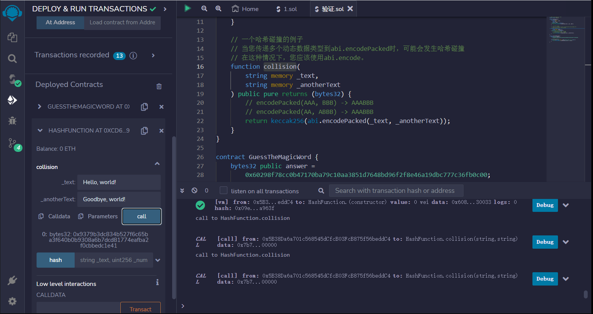
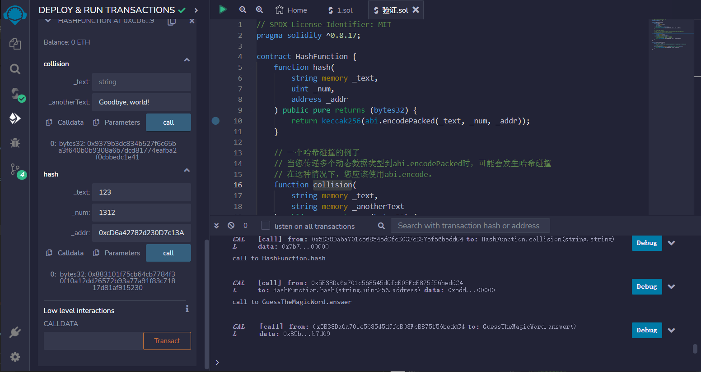
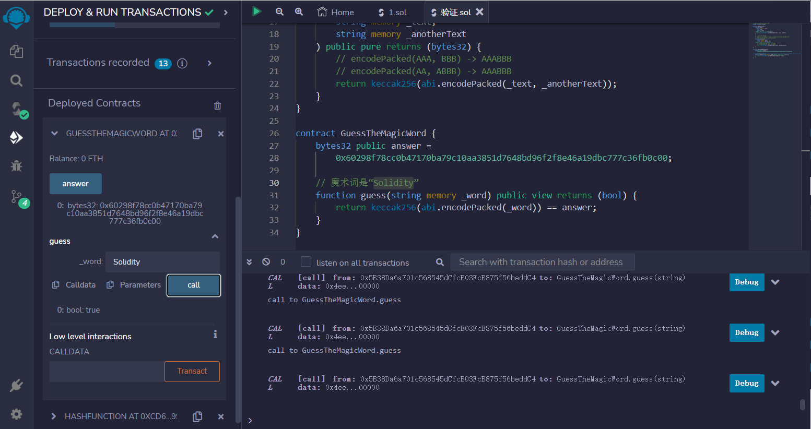

# Hashing with Keccak256
keccak256计算输入的Keccak-256哈希值。

一些用例包括：

## 从输入创建确定性唯一ID
## 提交-揭示方案
## 紧凑的加密签名（通过签署哈希而不是较大的输入）

```solidity
// SPDX-License-Identifier: MIT
pragma solidity ^0.8.17;

contract HashFunction {
    function hash(
        string memory _text,
        uint _num,
        address _addr
    ) public pure returns (bytes32) {
        return keccak256(abi.encodePacked(_text, _num, _addr));
    }

    // 一个哈希碰撞的例子
    // 当您传递多个动态数据类型到abi.encodePacked时，可能会发生哈希碰撞
    // 在这种情况下，您应该使用abi.encode。
    function collision(
        string memory _text,
        string memory _anotherText
    ) public pure returns (bytes32) {
        // encodePacked(AAA, BBB) -> AAABBB
        // encodePacked(AA, ABBB) -> AAABBB
        return keccak256(abi.encodePacked(_text, _anotherText));
    }
}

contract GuessTheMagicWord {
    bytes32 public answer =
        0x60298f78cc0b47170ba79c10aa3851d7648bd96f2f8e46a19dbc777c36fb0c00;

    // 魔术词是“Solidity”
    function guess(string memory _word) public view returns (bool) {
        return keccak256(abi.encodePacked(_word)) == answer;
    }
}
```


## remix验证
1.部署HashFunction合约，调用collision函数，传入string，尝试进行哈希碰撞

2.调用hash函数，输入一个字符串、一个整数和一个地址。验证返回哈希值。

3.部署GuessTheMagicWord合约，调用answer显示哈希，调用guess函数，输入“solidity”验证
