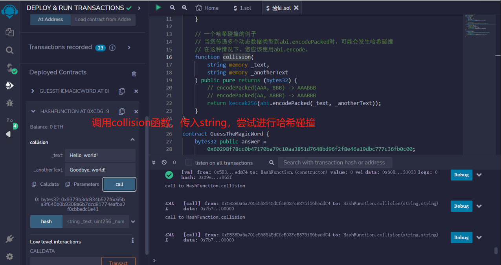
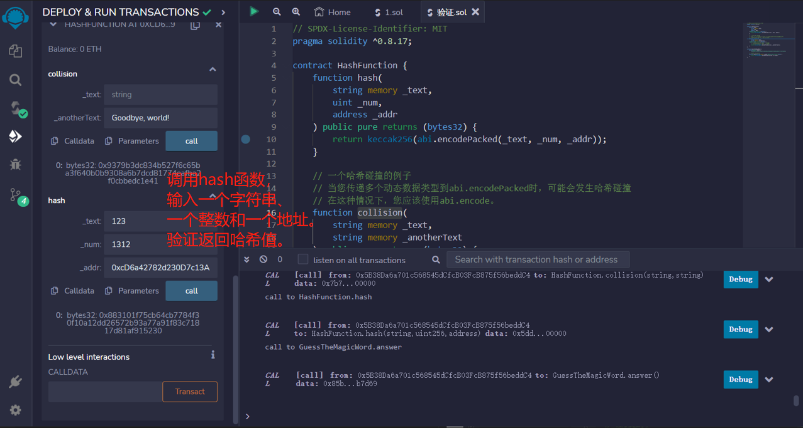
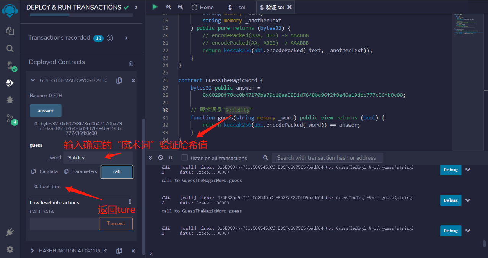

# 41.Hashing with Keccak256
哈希函数（hash function）是一个密码学概念，它可以将任意长度的消息转换为一个固定长度的值，这个值也称作哈希（hash）
## Hash的性质
一个好的哈希函数应该具有以下几个特性：

* 单向性：从输入的消息到它的哈希的正向运算简单且唯一确定，而反过来非常难，只能靠暴力枚举。
* 灵敏性：输入的消息改变一点对它的哈希改变很大。
* 高效性：从输入的消息到哈希的运算高效。
* 均一性：每个哈希值被取到的概率应该基本相等。
* 抗碰撞性：
    * 弱抗碰撞性：给定一个消息x，找到另一个消息x'使得hash(x) =hash(x')是困难的。
    * 强抗碰撞性：找到任意x和x'，使得hash(x) = hash(x')是困难的。
keccak256计算输入的Keccak-256哈希值。

## Hash的应用

* 从输入中创建确定性唯一ID
* 提交-揭示方案
* 紧凑的加密签名（通过签署哈希而不是较大的输入）

```solidity
// SPDX-License-Identifier: MIT
pragma solidity ^0.8.17;

contract HashFunction {
    function hash(
        string memory _text,
        uint _num,
        address _addr
    ) public pure returns (bytes32) {
        return keccak256(abi.encodePacked(_text, _num, _addr));
    }

    // 一个哈希碰撞的例子
    // 当您传递多个动态数据类型到abi.encodePacked时，可能会发生哈希碰撞
    // 在这种情况下，您应该使用abi.encode。
    function collision(
        string memory _text,
        string memory _anotherText
    ) public pure returns (bytes32) {
        // encodePacked(AAA, BBB) -> AAABBB
        // encodePacked(AA, ABBB) -> AAABBB
        return keccak256(abi.encodePacked(_text, _anotherText));
    }
}
```

## 哈希碰撞
尝试哈希值相同
下列函数将_word参数编码为字节数组，并通过keccak256哈希函数计算其哈希值，然后将其与answer变量的值进行比较。如果两个哈希值相等，则返回true，否则返回false。
```solidity
contract GuessTheMagicWord {
    bytes32 public answer =
        0x60298f78cc0b47170ba79c10aa3851d7648bd96f2f8e46a19dbc777c36fb0c00;

    // 魔术词是“Solidity”
    function guess(string memory _word) public view returns (bool) {
        return keccak256(abi.encodePacked(_word)) == answer;
    }
}
```


## remix验证
1. 部署HashFunction合约，调用collision函数，传入string，尝试进行哈希碰撞

2. 调用hash函数，输入一个字符串、一个整数和一个地址。验证返回哈希值。

3. 部署GuessTheMagicWord合约，调用answer显示哈希，调用guess函数，输入“solidity”验证
