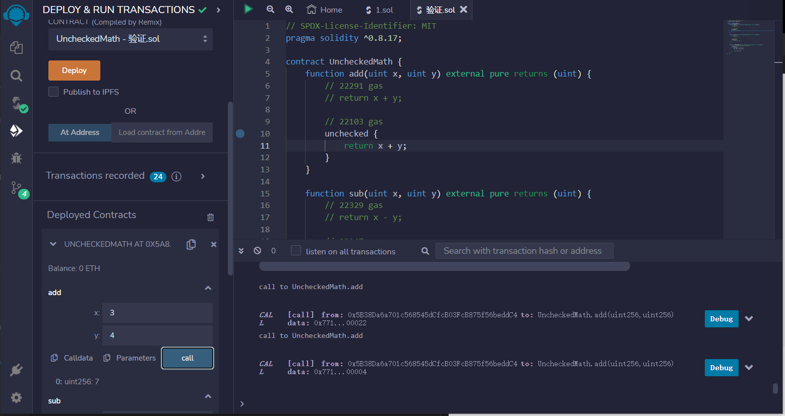
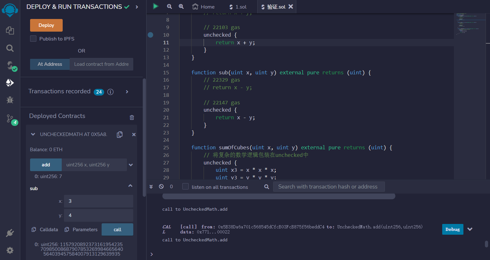
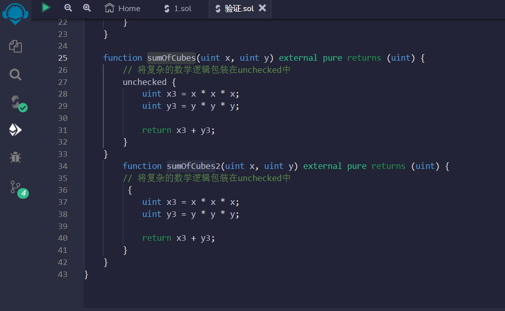
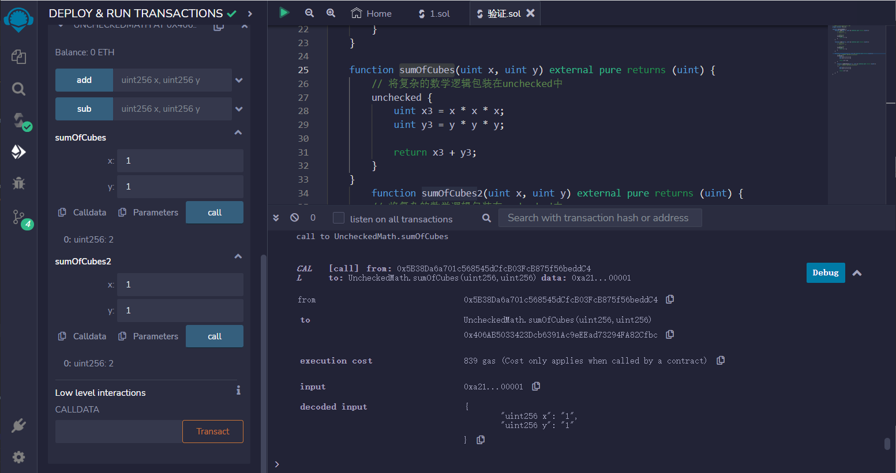
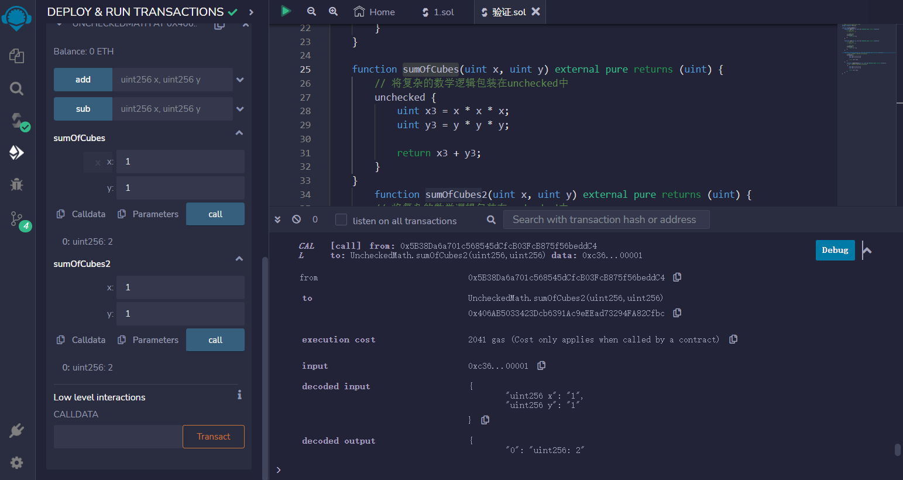

# Unchecked Math
在Solidity 0.8中，数字的上溢和下溢会引发错误。这可以通过使用unchecked来禁用。
禁用上溢/下溢检查可以节省gas。


```solidity
// SPDX-License-Identifier: MIT
pragma solidity ^0.8.17;

contract UncheckedMath {
    function add(uint x, uint y) external pure returns (uint) {
        // 22291 gas
        // return x + y;

        // 22103 gas
        unchecked {
            return x + y;
        }
    }

    function sub(uint x, uint y) external pure returns (uint) {
        // 22329 gas
        // return x - y;

        // 22147 gas
        unchecked {
            return x - y;
        }
    }

    function sumOfCubes(uint x, uint y) external pure returns (uint) {
        // 将复杂的数学逻辑包装在unchecked中
        unchecked {
            uint x3 = x * x * x;
            uint y3 = y * y * y;

            return x3 + y3;
        }
    }
}
```


## remix验证
1.部署UncheckedMath合约，调用add函数x=3，y=4，未发生上溢

2.调用sub函数x=3，y=4，发生下溢

3.更改函数sumOfCubes中的unchecked，改为为sumOfCubes2，对比两个函数gas消耗

sumOfCubes

sumOfCubes2
