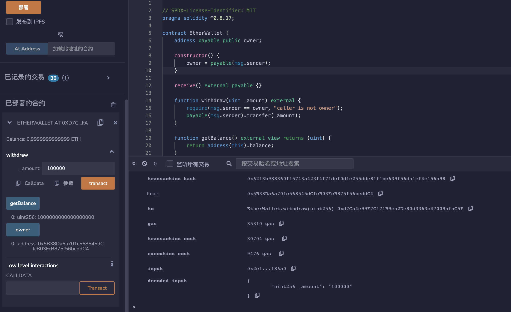
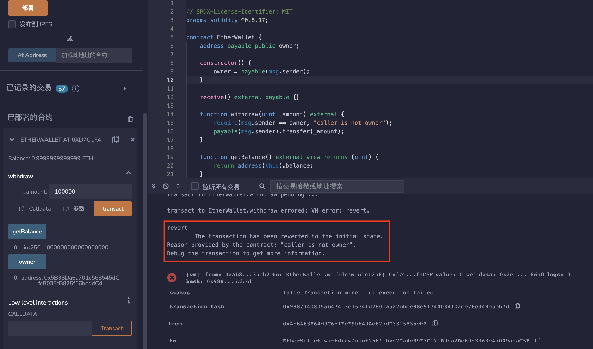

# 46.Ether Wallet
举一个基本钱包的例子。

* 任何人都可以发送ETH。
* 只有所有者才能提取。
```solidity

contract EtherWallet {
    address payable public owner;

    constructor() {
        owner = payable(msg.sender);
    }

    receive() external payable {}

    function withdraw(uint _amount) external {
        require(msg.sender == owner, "caller is not owner");
        payable(msg.sender).transfer(_amount);
    }

    function getBalance() external view returns (uint) {
        return address(this).balance;
    }
}
```

## remix验证
部署钱包合约，通过CALLDATA调用receive（）转入1ETH，然后调用withdraw（）函数，调用者为owner时，调用成功。

调用者为其他地址时，调用失败。


