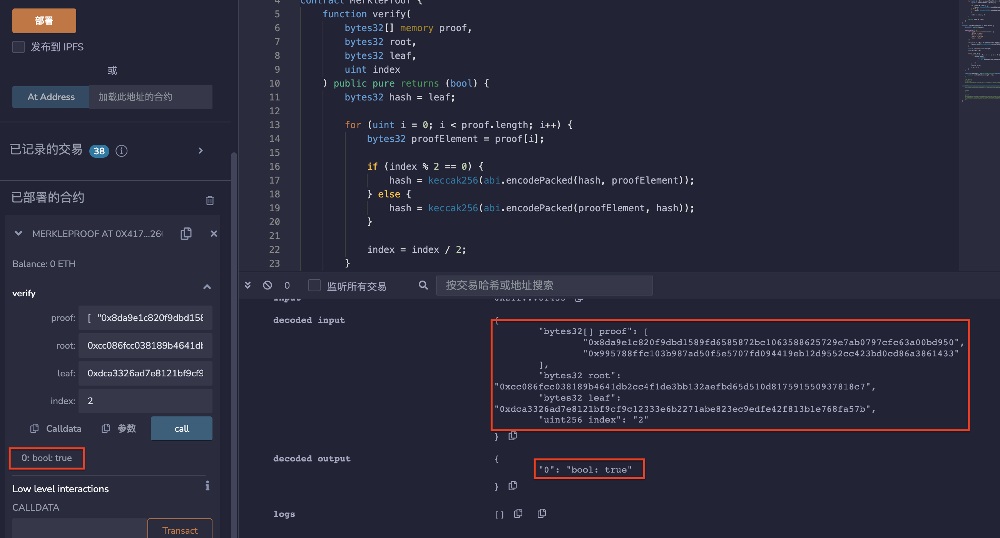

# 48.Merkle Tree
Merkle Tree允许你在不公开整个集合的情况下，加密证明一个元素包含在该集合中。
```solidity

// SPDX-License-Identifier: MIT
pragma solidity ^0.8.17;

contract MerkleProof {
    function verify(
        bytes32[] memory proof,
        bytes32 root,
        bytes32 leaf,
        uint index
    ) public pure returns (bool) {
        bytes32 hash = leaf;

        for (uint i = 0; i < proof.length; i++) {
            bytes32 proofElement = proof[i];

            if (index % 2 == 0) {
                hash = keccak256(abi.encodePacked(hash, proofElement));
            } else {
                hash = keccak256(abi.encodePacked(proofElement, hash));
            }

            index = index / 2;
        }

        return hash == root;
    }
}

contract TestMerkleProof is MerkleProof {
    bytes32[] public hashes;

    constructor() {
        string[4] memory transactions = [
            "alice -> bob",
            "bob -> dave",
            "carol -> alice",
            "dave -> bob"
        ];

        for (uint i = 0; i < transactions.length; i++) {
            hashes.push(keccak256(abi.encodePacked(transactions[i])));
        }

        uint n = transactions.length;
        uint offset = 0;

        while (n > 0) {
            for (uint i = 0; i < n - 1; i += 2) {
                hashes.push(
                    keccak256(
                        abi.encodePacked(hashes[offset + i], hashes[offset + i + 1])
                    )
                );
            }
            offset += n;
            n = n / 2;
        }
    }

    function getRoot() public view returns (bytes32) {
        return hashes[hashes.length - 1];
    }

    /* verify
    3rd leaf
    0xdca3326ad7e8121bf9cf9c12333e6b2271abe823ec9edfe42f813b1e768fa57b

    root
    0xcc086fcc038189b4641db2cc4f1de3bb132aefbd65d510d817591550937818c7

    index
    2

    proof
    0x8da9e1c820f9dbd1589fd6585872bc1063588625729e7ab0797cfc63a00bd950
    0x995788ffc103b987ad50f5e5707fd094419eb12d9552cc423bd0cd86a3861433
    */
}
``` 
# remix验证
部署合约MerkleProof，调用verify并输入上文参数验证，结果为true。

