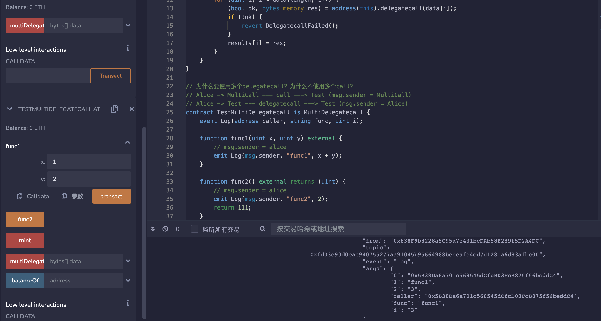

# 64.Multi Delegatecall
Multi Delegatecall是一种Solidity中的特殊函数调用方式，它允许在一个合约内调用多个函数，从而可以简化复杂的操作。
Multi Delegatecall的特点是将调用的函数合并在一起，共享合约状态，但是不会改变调用合约的上下文，即不会改变合约地址和合约存储状态。
这种调用方式通常用于合约库的实现，可以将多个函数合并在一起，从而减少调用次数和gas消耗。
但是需要注意的是，Multi Delegatecall需要确保调用的函数在同一合约中，且需要保证函数签名和参数类型一致。

使用delegatecall在单个交易中调用多个函数的示例。
```solidity
// SPDX-License-Identifier: MIT
pragma solidity ^0.8.17;

contract MultiDelegatecall {
    error DelegatecallFailed();

    function multiDelegatecall(
        bytes[] memory data
    ) external payable returns (bytes[] memory results) {
        results = new bytes[](data.length);

        for (uint i; i < data.length; i++) {
            (bool ok, bytes memory res) = address(this).delegatecall(data[i]);
            if (!ok) {
                revert DelegatecallFailed();
            }
            results[i] = res;
        }
    }
}

// 为什么要使用多个delegatecall？为什么不使用多个call？
// Alice -> MultiCall --- call ---> Test (msg.sender = MultiCall)
// Alice -> Test --- delegatecall ---> Test (msg.sender = Alice)
contract TestMultiDelegatecall is MultiDelegatecall {
    event Log(address caller, string func, uint i);

    function func1(uint x, uint y) external {
        // msg.sender = alice
        emit Log(msg.sender, "func1", x + y);
    }

    function func2() external returns (uint) {
        // msg.sender = alice
        emit Log(msg.sender, "func2", 2);
        return 111;
    }

    mapping(address => uint) public balanceOf;

    // 当与多个delegatecall结合使用时，代码存在不安全性。
    // 用户可以以msg.value的价格多次铸造。
    function mint() external payable {
        balanceOf[msg.sender] += msg.value;
    }
}

contract Helper {
    function getFunc1Data(uint x, uint y) external pure returns (bytes memory) {
        return abi.encodeWithSelector(TestMultiDelegatecall.func1.selector, x, y);
    }

    function getFunc2Data() external pure returns (bytes memory) {
        return abi.encodeWithSelector(TestMultiDelegatecall.func2.selector);
    }

    function getMintData() external pure returns (bytes memory) {
        return abi.encodeWithSelector(TestMultiDelegatecall.mint.selector);
    }
}
```
## remix验证
部署合约MultiDelegatecall和TestMultiDelegatecall，调用func1（）函数，释放事件。

