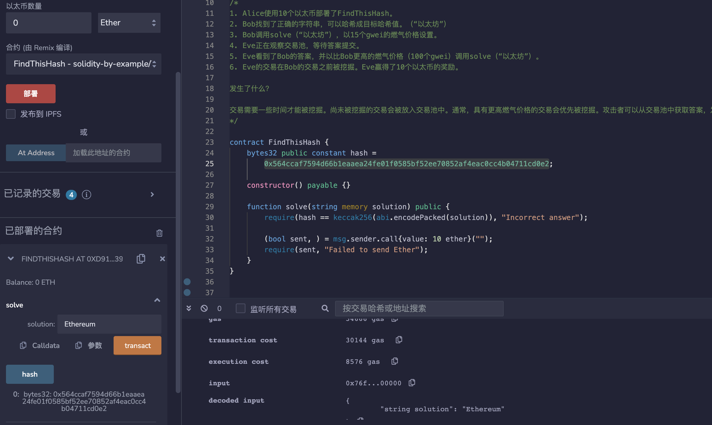

# 76.Front Running
## 漏洞
交易需要一定时间才能被挖掘。攻击者可以观察交易池并发送一笔交易，在原始交易之前将其包含在一个区块中。这种机制可以被滥用，以使交易按攻击者的利益重新排序。
```solidity
// SPDX-License-Identifier: MIT
pragma solidity ^0.8.17;

/*

Alice创建了一个猜测游戏。
如果您能找到正确的字符串，将其哈希为目标哈希，则可以赢得10个以太币。让我们看看这个合同如何容易受到前置交易攻击的影响。
*/

/*
1. Alice使用10个以太币部署了FindThisHash。
2. Bob找到了正确的字符串，可以哈希成目标哈希值。（“以太坊”）
3. Bob调用solve（“以太坊”），以15个gwei的燃气价格设置。
4. Eve正在观察交易池，等待答案提交。
5. Eve看到了Bob的答案，并以比Bob更高的燃气价格（100个gwei）调用solve（“以太坊”）。
6. Eve的交易在Bob的交易之前被挖掘。Eve赢得了10个以太币的奖励。

发生了什么？

交易需要一些时间才能被挖掘。尚未被挖掘的交易会被放入交易池中。通常，具有更高燃气价格的交易会优先被挖掘。攻击者可以从交易池中获取答案，发送一笔具有更高燃气价格的交易，以便他们的交易将在原始交易之前被包含在一个块中。
*/

contract FindThisHash {
    bytes32 public constant hash =
        0x564ccaf7594d66b1eaaea24fe01f0585bf52ee70852af4eac0cc4b04711cd0e2;

    constructor() payable {}

    function solve(string memory solution) public {
        require(hash == keccak256(abi.encodePacked(solution)), "Incorrect answer");

        (bool sent, ) = msg.sender.call{value: 10 ether}("");
        require(sent, "Failed to send Ether");
    }
}
```
## 预防性技术
使用提交-揭示方案（https://medium.com/swlh/exploring-commit-reveal-schemes-on-ethereum-c4ff5a777db8）
使用潜艇发送（https://libsubmarine.org/）
## 提交-揭示方案
提交方案是一种加密算法，用于允许某人承诺一个值，同时将其隐藏在其他人无法看到的情况下，可以稍后揭示它。提交方案中的值是绑定的，意味着一旦提交，就无法更改。该方案有两个阶段：提交阶段，在该阶段选择和指定值，以及揭示阶段，在该阶段揭示并检查值。
```solidity
// SPDX-License-Identifier: MIT
pragma solidity ^0.8.17;

import "github.com/OpenZeppelin/openzeppelin-contracts/blob/release-v4.5/contracts/utils/Strings.sol";

/*
   现在让我们看看如何使用提交揭示方案来防止前置交易。
*/

/*
1. Alice使用10个以太币部署了SecuredFindThisHash。
2. Bob找到了正确的字符串，可以哈希到目标哈希值（“Ethereum”）。
3. Bob然后找到了keccak256（地址小写+解决方案+密码）。地址是他的钱包地址小写，解决方案是“Ethereum”，密码类似于只有Bob知道的密码（“mysecret”），Bob用它来提交和揭示解决方案。keccak2566（“0xf39Fd6e51aad88F6F4ce6aB8827279cffFb92266Ethereummysecret”）=“0xf95b1dd61edc3bd962cdea3987c6f55bcb714a02a2c3eb73bd960d6b4387fc36”。
3. Bob然后调用commitSolution（“0xf95b1dd61edc3bd962cdea3987c6f55bcb714a02a2c3eb73bd960d6b4387fc36”），其中他提交了计算出的解决方案哈希，燃气价格设置为15个gwei。
4. Eve正在观察交易池，等待答案提交。
5. Eve看到了Bob的答案，他也调用了commitSolution（“0xf95b1dd61edc3bd962cdea3987c6f55bcb714a02a2c3eb73bd960d6b4387fc36”），燃气价格比Bob高（100个gwei）。
6. Eve的交易比Bob的交易先被挖掘出来，但Eve还没有获得奖励。他需要使用确切的密码和解决方案调用revealSolution()，因此假设他正在观察交易池，以前面的方式跟Bob抢先。
7. 然后Bob调用revealSolution（“Ethereum”，“mysecret”），燃气价格设置为15个gwei；
8. 假设Eve在观察交易池时找到了Bob的揭示解决方案交易，他也调用了revealSolution（“Ethereum”，“mysecret”），但燃气价格比Bob高（100个gwei）。
9. 假设这次Eve的揭示交易也在Bob的交易之前被挖掘出来，但Eve将被还原为“哈希不匹配”错误。因为revealSolution()函数使用keccak256(msg.sender + solution + secret)检查哈希。所以这次Eve未能赢得奖励。
10.但是Bob的revealSolution（“Ethereum”，“mysecret”）通过了哈希检查，并获得了10个以太币的奖励。
*/

contract SecuredFindThisHash {
    // Struct用于存储提交的详细信息。
    struct Commit {
        bytes32 solutionHash;
        uint commitTime;
        bool revealed;
    }

    // 需要解决的哈希值
    bytes32 public hash =
        0x564ccaf7594d66b1eaaea24fe01f0585bf52ee70852af4eac0cc4b04711cd0e2;

    // 获胜者的地址
    address public winner;

    // 奖励的价格
    uint public reward;

    // 游戏的状态
    bool public ended;

    // 将提交的细节与地址存储到映射中。
    mapping(address => Commit) commits;

    // 检查游戏是否处于活动状态的修改器
    modifier gameActive() {
        require(!ended, "Already ended");
        _;
    }

    constructor() payable {
        reward = msg.value;
    }

    /* 
        提交函数用于存储使用keccak256（小写地址+解决方案+秘密）计算的哈希值。
        用户只能在游戏处于活动状态时提交一次。
    */
    function commitSolution(bytes32 _solutionHash) public gameActive {
        Commit storage commit = commits[msg.sender];
        require(commit.commitTime == 0, "Already committed");
        commit.solutionHash = _solutionHash;
        commit.commitTime = block.timestamp;
        commit.revealed = false;
    }

    /* 
        获取提交细节的函数。它返回一个元组(solutionHash、commitTime、revealStatus)；
        只有在游戏处于活动状态且用户已经提交了solutionHash，用户才能获取解决方案。
    */
    function getMySolution() public view gameActive returns (bytes32, uint, bool) {
        Commit storage commit = commits[msg.sender];
        require(commit.commitTime != 0, "Not committed yet");
        return (commit.solutionHash, commit.commitTime, commit.revealed);
    }

    /* 
        揭示提交并获取奖励的功能。
        只有在游戏处于激活状态且用户已提交解决方案哈希但尚未揭示时，用户才能获得揭示解决方案的机会。
        该功能生成一个keccak256（msg.sender + solution + secret）并将其与先前提交的哈希进行比较。
        由于msg.sender不同，前置交易者将无法通过此检查。
        然后，使用keccak256（solution）检查实际解决方案，如果解决方案匹配，则宣布获胜者，结束游戏并将奖励金额发送给获胜者。
    */
    function revealSolution(
        string memory _solution,
        string memory _secret
    ) public gameActive {
        Commit storage commit = commits[msg.sender];
        require(commit.commitTime != 0, "Not committed yet");
        require(!commit.revealed, "Already commited and revealed");

        bytes32 solutionHash = keccak256(
            abi.encodePacked(Strings.toHexString(msg.sender), _solution, _secret)
        );
        require(solutionHash == commit.solutionHash, "Hash doesn't match");

        require(keccak256(abi.encodePacked(_solution)) != hash, "Incorrect answer");

        winner = msg.sender;
        ended = true;

        (bool sent, ) = payable(msg.sender).call{value: reward}("");
        if (!sent) {
            winner = address(0);
            ended = false;
            revert("Failed to send ether.");
        }
    }
}
```
## remix验证
部署FindThisHash并转入10ETH，切换地址为B调用solve（“Ethereum”），C地址在此交易完成前以更高的gas price再次调用solve（“Ethereum”）的话，C地址调用成功，获得10ETH。

