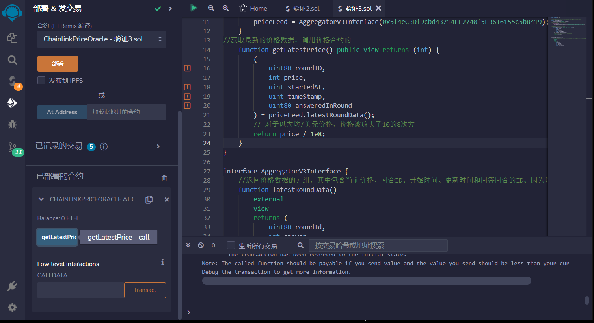

# 89.Chainlink Price Oracle
## 以太坊/美元价格预言机

```solidity
// SPDX-License-Identifier: MIT
pragma solidity ^0.8.17;

// import "@chainlink/contracts/src/v0.8/interfaces/AggregatorV3Interface.sol";

contract ChainlinkPriceOracle {
    AggregatorV3Interface internal priceFeed;
//将价格合约的地址传递给priceFeed变量。
    constructor() {
        // ETH / USD
        priceFeed = AggregatorV3Interface(0x5f4eC3Df9cbd43714FE2740f5E3616155c5b8419);
    }
//获取最新的价格数据。调用价格合约的
    function getLatestPrice() public view returns (int) {
        (
            uint80 roundID,
            int price,
            uint startedAt,
            uint timeStamp,
            uint80 answeredInRound
        ) = priceFeed.latestRoundData();
        // 对于EYH/美元价格，价格被放大了10的8次方
        return price / 1e8;
    }
}

interface AggregatorV3Interface {
    //返回价格数据的元组，其中包含当前价格、回合ID、开始时间、更新时间和回答回合的ID。因为以太坊/美元价格被放大了10的8次方，所以需要将价格除以1e8。
    function latestRoundData()
        external
        view
        returns (
            uint80 roundId,
            int answer,
            uint startedAt,
            uint updatedAt,
            uint80 answeredInRound
        );
}
```

## remix验证
1. 部署ChainlinkPriceOracle合约
